<div align="center">

```
 █████╗ ██████╗ ██╗ █████╗
██╔══██╗██╔══██╗██║██╔══██╗
███████║██████╔╝██║███████║
██╔══██║██╔══██╗██║██╔══██║
██║  ██║██║  ██║██║██║  ██║
╚═╝  ╚═╝╚═╝  ╚═╝╚═╝╚═╝  ╚═╝
```

# ✦ ARIA - Autonomous Reply & Intelligence Assistant

### *Your entire digital life. One Telegram chat. Zero context switching.*

<br/>

[](https://python.org)
[](https://fastapi.tiangolo.com)
[](https://www.postgresql.org)
[](https://redis.io)
[](https://docker.com)
[](https://groq.com)
[](https://nodejs.org)
[](./LICENSE)
[](https://github.com/aanandmodi/ARIA)

<br/>

> *"Instead of jumping between WhatsApp, Gmail, Slack, Discord, Spotify, Notion, and GitHub -*
> *ARIA brings everything to one place: your Telegram chat."*

<br/>

---

</div>

## 📑 Table of Contents

- [🧠 Abstract](#-abstract)
- [💡 The Problem ARIA Solves](#-the-problem-aria-solves)
- [✨ Key Features](#-key-features)
- [🏗 System Architecture](#-system-architecture)
- [🔬 Component Deep Dive](#-component-deep-dive)
  - [Nginx — Ingress](#1-nginx--reverse-proxy--ingress)
  - [FastAPI Server](#2-fastapi-server-api)
  - [ARQ Task Worker](#3-arq-task-worker-apiworkers)
  - [Baileys Bridge](#4-baileys-whatsapp-bridge-baileys)
  - [Groq LLM Engine](#5-groq-llm-engine-apillm)
  - [Handlers](#6-handlers-apihandlers)
  - [Services](#7-services-apiservices)
- [🤖 LLM Pipeline](#-llm-pipeline--how-intelligence-works)
- [🗄 Database Architecture](#-database-architecture--pipeline)
- [📥 Inbound Communication Flow](#-communication-flow--inbound)
- [📤 Outbound Command Flow](#-communication-flow--outbound)
- [🔗 Integration Map](#-integration-map)
- [🛠 Tech Stack](#-tech-stack)
- [📂 Folder Structure](#-folder-structure)
- [🐳 Docker Infrastructure](#-infrastructure--docker-services)
- [🚀 Quick Start](#-quick-start)
- [🔧 Environment Variables](#-environment-variables)
- [🔄 Full Connection Map](#-how-each-piece-connects)
- [🤝 Contributing](#-contributing)

---

## 🧠 Abstract

**ARIA** *(Autonomous Reply & Intelligence Assistant)* is a self-hosted, multi-agent AI backend that eliminates digital context-switching. It acts as a **bidirectional intelligence bridge** between you and your entire digital ecosystem.

At its core, ARIA is a **webhook-ingestion + intent-parsing engine**:

| Step | What ARIA Does |
|:----:|----------------|
| **①** | **Receives** events from Gmail, WhatsApp, Slack, Discord, and SMS |
| **②** | **Classifies** every message with Groq LLaMA 3 — scoring urgency, importance & tone |
| **③** | **Filters** noise — only messages above your `IMPORTANCE_THRESHOLD` alert you |
| **④** | **Routes** your Telegram commands through an intent parser to the right service |
| **⑤** | **Persists** everything — messages, intents, expenses, habits — in PostgreSQL |

> The result: a single Telegram bot that manages your entire digital life, powered by a real LLM, running entirely on your own hardware.

---

## 💡 The Problem ARIA Solves

<table>
<tr>
<td width="50%">

### ❌ Without ARIA

```
📱 WhatsApp  → open app
📧 Gmail     → open app
💬 Slack     → open app
🎮 Discord   → open app
📓 Notion    → open browser
🎵 Spotify   → open app
💻 GitHub    → open browser
📊 Finances  → spreadsheet

  ╔══════════════════════╗
  ║  8 apps to manage    ║
  ║  Constant switching  ║
  ║  Hours lost daily    ║
  ╚══════════════════════╝
```

</td>
<td width="50%">

### ✅ With ARIA

```
🤖 Telegram Bot  (1 interface)
│
├── 📩 WhatsApp messages
├── 📧 Gmail (scored & triaged)
├── 💬 Slack threads
├── 🎮 Discord DMs
├── 📓 Notion tasks
├── 🎵 Spotify controls
├── 💰 Expense tracking
└── 📅 Calendar & reminders

  ╔══════════════════════╗
  ║  0 context switches  ║
  ║  1 unified interface ║
  ║  AI does the work    ║
  ╚══════════════════════╝
```

</td>
</tr>
</table>

---

## ✨ Key Features

<table>
<tr><th>Feature</th><th>Description</th></tr>
<tr><td>🗂 <b>Unified Smart Inbox</b></td><td>Gmail, WhatsApp, Discord, Slack, SMS → one Telegram chat</td></tr>
<tr><td>🧮 <b>AI Importance Scoring</b></td><td>Every message scored 1–10 for urgency; only high-priority ones alert you</td></tr>
<tr><td>✍️ <b>Tone-Aware Replies</b></td><td>Prefix with <code>professional:</code> or <code>casual:</code> — ARIA reformats for the target platform</td></tr>
<tr><td>🎙 <b>Voice Note Transcription</b></td><td>Inbound voice messages auto-transcribed via Groq Whisper</td></tr>
<tr><td>🌅 <b>Morning Briefing</b></td><td>Daily digest: weather + calendar + urgent emails + stocks/crypto + HN stories</td></tr>
<tr><td>💬 <b>Natural Language Commands</b></td><td>"Remind me to call John tomorrow", "Log $50 food expense", "What's my schedule?"</td></tr>
<tr><td>📊 <b>Expense Tracking</b></td><td>Log and summarize financial transactions via natural language</td></tr>
<tr><td>✅ <b>Habit Tracking</b></td><td>Track daily habits and receive streak reminders</td></tr>
<tr><td>🔔 <b>Keyword Alerts</b></td><td>Monitor RSS feeds and any source for specific keywords</td></tr>
<tr><td>🔒 <b>Privacy First</b></td><td>100% self-hosted. No cloud services own your data. PostgreSQL stays on your machine</td></tr>
<tr><td>🐳 <b>One-Command Deploy</b></td><td>Full <code>docker compose up -d</code> setup with zero manual config</td></tr>
</table>

---

## 🏗 System Architecture

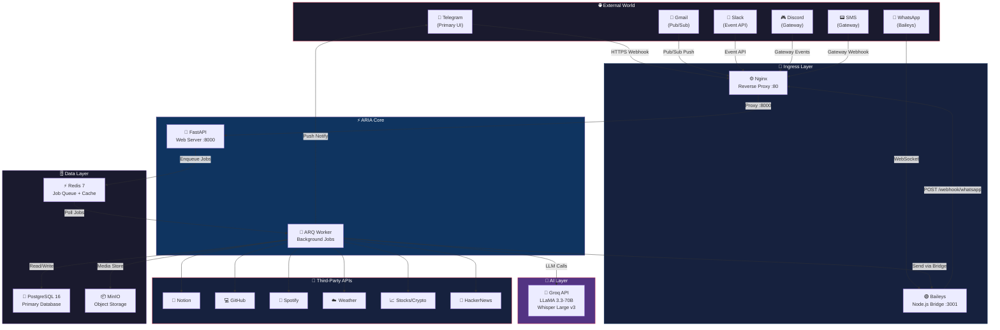

---

## 🔬 Component Deep Dive

### 1. Nginx — Reverse Proxy / Ingress

Nginx is the **single public-facing door** to ARIA. It terminates HTTPS, routes webhook requests, and rate-limits traffic.

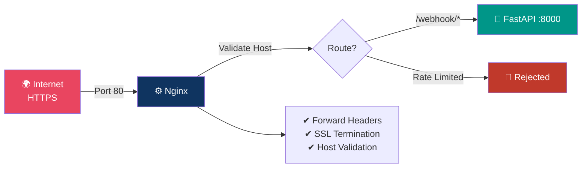

**Config file:** `nginx.conf`

---

### 2. FastAPI Server (`api/`)

The brain of ARIA's request handling.

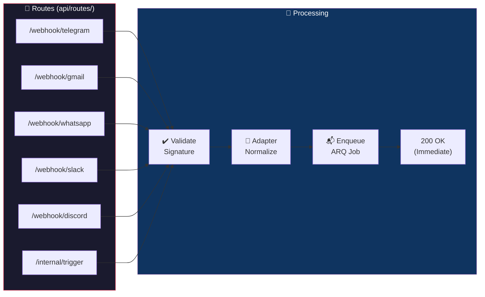

---

### 3. ARQ Task Worker (`api/workers/`)

The async **workhorse** that processes every job from Redis.

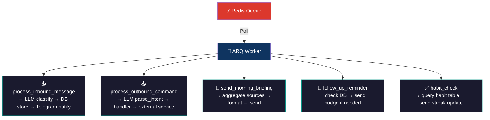

---

### 4. Baileys WhatsApp Bridge (`baileys/`)

A dedicated **Node.js / Express** microservice maintaining the WhatsApp Web multi-device WebSocket session.

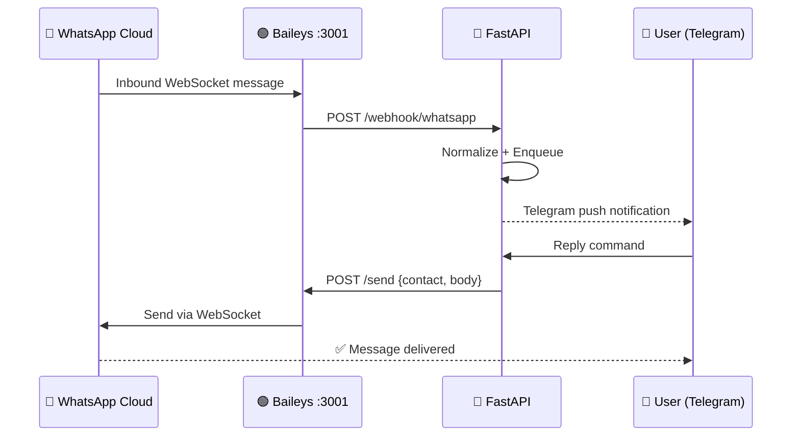

**Key files:** `baileys/index.js`, `baileys/Dockerfile`

#### 📱 WhatsApp JID Namespace & Companion LID Resolution Heuristic
WhatsApp personal contact routing has a highly complex, protocol-level division that standard bridges fail to support:
* **Standard JIDs (`@s.whatsapp.net`):** Normal phone accounts (e.g. `918829095225@s.whatsapp.net`).
* **LID JIDs (`@lid`):** WhatsApp's companion device/hidden identifiers (e.g. `38302585458926@lid`).
* **Group JIDs (`@g.us`):** Group channels (e.g. `120363422974535988@g.us`).

If you attempt to send an LID message using `@s.whatsapp.net`, the WhatsApp server silently discards it into a black hole! 

To solve this, ARIA implements a **mathematical JID length-and-prefix resolution heuristic** right in the handler layer:

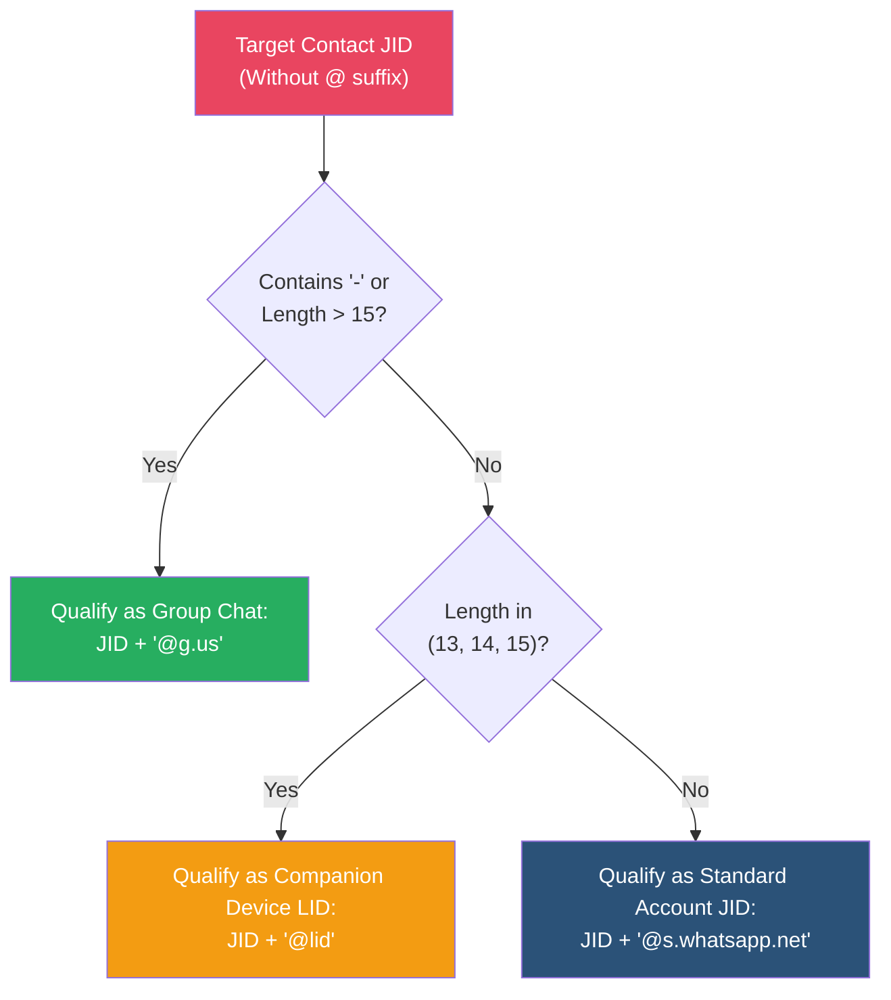

##### JID Namespace Comparison Table

| Format | Length (digits) | Prefix Characteristics | Suffix Appended | Delivery Namespace |
| :--- | :---: | :--- | :---: | :--- |
| **Standard Phone** | Exactly 12 | Starts with Country Code (e.g. `91` for India) | `@s.whatsapp.net` | Standard Chat |
| **Companion LID** | 13, 14, or 15 | Starts with companion nodes (`18`, `27`, `38`, `95`) | `@lid` | Companion/Hidden Account |
| **Group Chat** | > 15 | Starts with `1203` | `@g.us` | Group Threads |

---

### 5. Groq LLM Engine (`api/llm/`)

ARIA uses **two Groq models** for different tasks:

| Model | Task | Max Tokens |
|-------|------|-----------|
| `llama-3.3-70b-versatile` | Classification, intent parsing, reply reformatting | ~200 |
| `whisper-large-v3` | Voice note transcription | — |

**`classify(message)`** — Returns structured importance scoring:

```json
{
  "importance": 8,
  "urgency": "high",
  "summary": "Client asking for invoice by EOD",
  "tone": "professional",
  "suggested_reply": "I'll send it over within the hour."
}
```

**`parse_intent(command)`** — Converts natural language to a structured action:

```json
{
  "intent": "reply",
  "platform": "whatsapp",
  "contact": "John",
  "tone": "casual",
  "body": "Sure, see you at 6!"
}
```

---

### 6. Handlers (`api/handlers/`)

Each parsed intent maps to a dedicated handler:

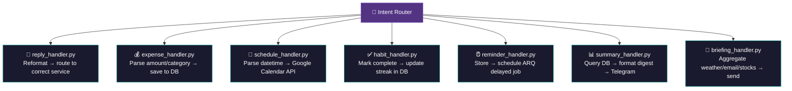

---

### 7. Services (`api/services/`)

Thin API client wrappers for each external platform:

| Service File | External API | Auth Method | Direction |
|---|---|---|---|
| `telegram_service.py` | Telegram Bot API | Bot Token | Bidirectional |
| `gmail_service.py` | Google Gmail API | OAuth 2.0 Refresh Token | Bidirectional |
| `whatsapp_service.py` | Baileys REST | Internal HTTP | Bidirectional |
| `slack_service.py` | Slack Web API | Bot Token | Bidirectional |
| `discord_service.py` | Discord Bot API | Bot Token | Bidirectional |
| `notion_service.py` | Notion API | Integration Token | Write only |
| `github_service.py` | GitHub REST API | Personal Access Token | Read only |
| `spotify_service.py` | Spotify Web API | OAuth 2.0 | Bidirectional |
| `sms_service.py` | SMS Gateway | API Token | Bidirectional |

---

## 🤖 LLM Pipeline — How Intelligence Works

### 📥 Inbound Classification Pipeline

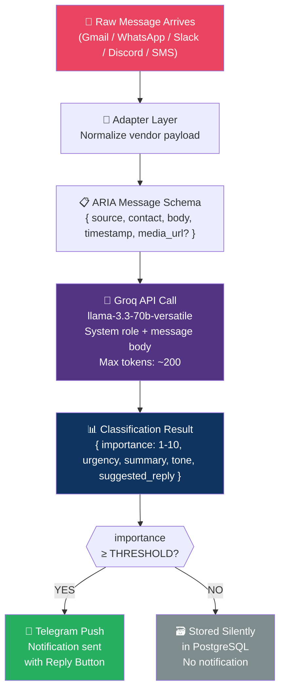

### 📤 Outbound Intent Pipeline

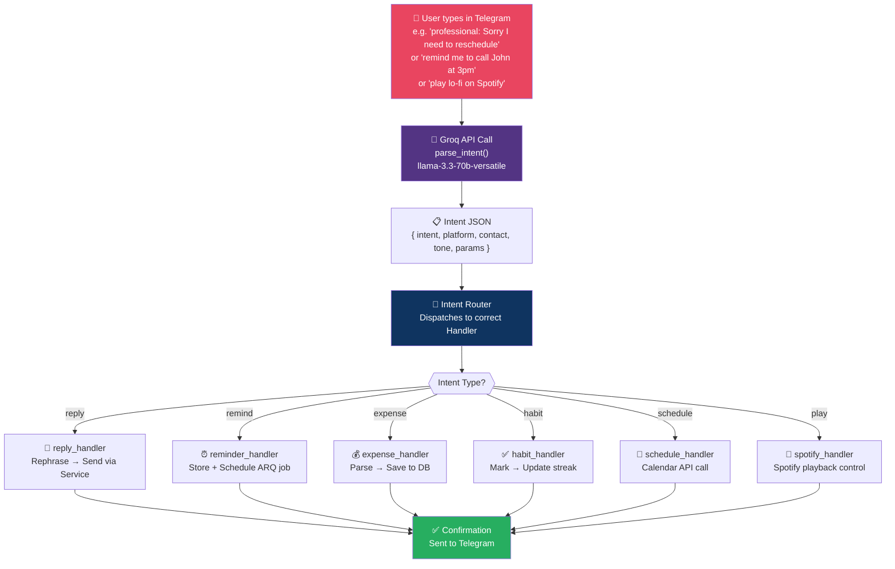

### 🎙 Voice Note Pipeline

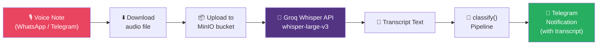

### 🔄 Context-Aware NLU Pipeline (Sliding Window Classifier)

Standard chatbots suffer from context dropouts on short replies (e.g. you say `"yes"`, `"do it"`, or `"hi"` and the bot defaults to generic conversational chatter). 

ARIA implements a **V2 Context-Aware Sliding Window Intent Classifier** (`intent_unified.py`) that formats and injects the last 3 conversation turns from your Telegram Redis cache directly into the system prompt. This allows LLaMA 3.3 to resolve vague pronouns and follow-up replies perfectly.

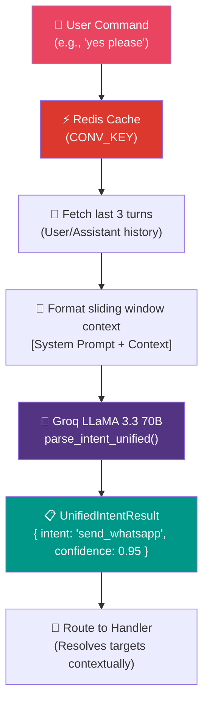

### 🐙 GitHub Watcher & Monitored Repository Watcher Pipeline

ARIA keeps you updated on your codebase asynchronously using a highly optimized background cron task worker:

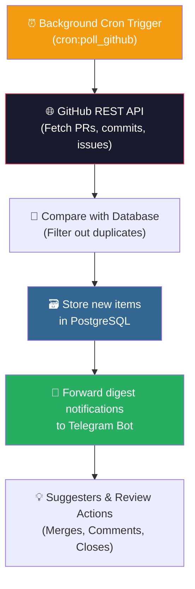

---

## 🗄 Database Architecture & Pipeline

ARIA uses **PostgreSQL 16** with **SQLAlchemy Async ORM**. Migrations managed by **Alembic**.

### Entity Relationship Diagram

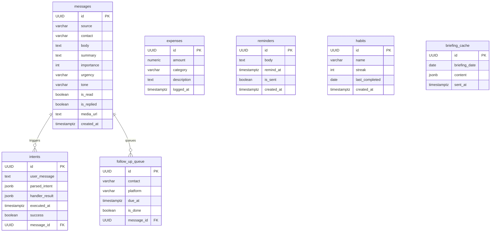

### Database Write Pipeline

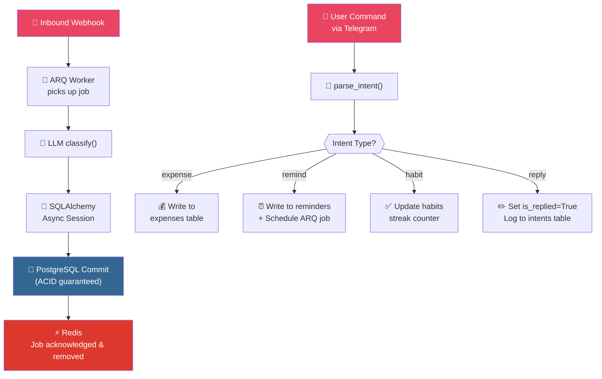

### Alembic Migration Pipeline

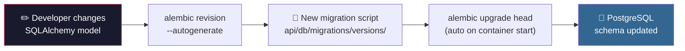

---

## 📥 Communication Flow — Inbound

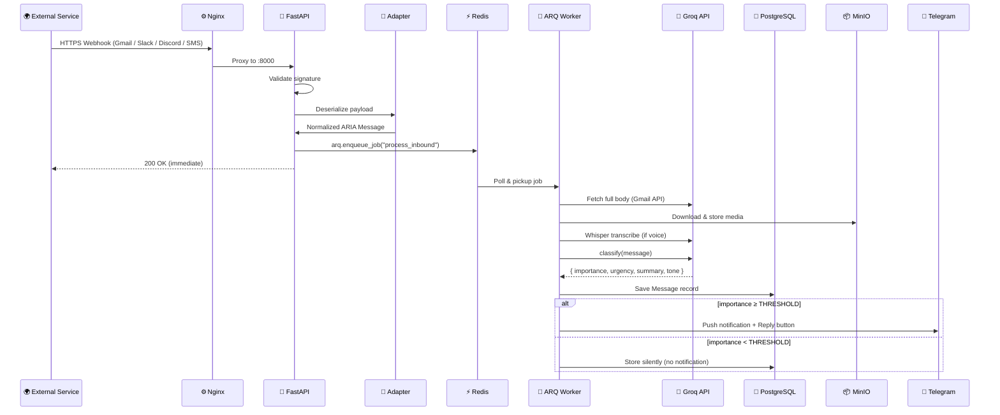

---

## 📤 Communication Flow — Outbound

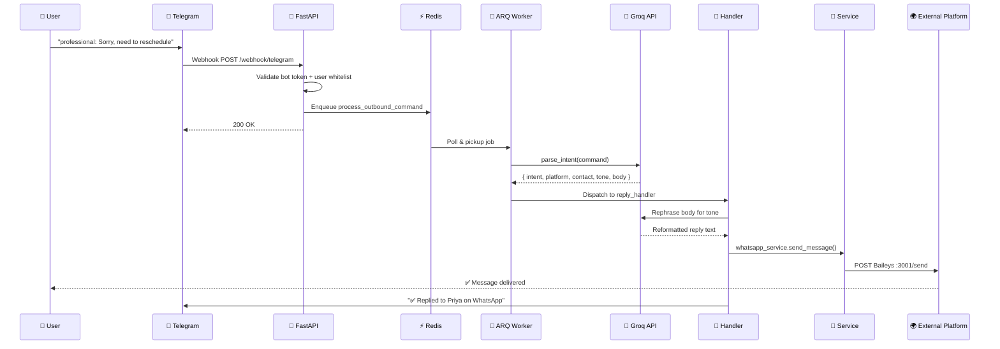

---

## 🔗 Integration Map

```mermaid
graph TB
    CORE["⚡ ARIA CORE\nFastAPI + ARQ Worker"]

    subgraph MSG["💬 Messaging"]
        TG["📱 Telegram\nPrimary UI"]
        WA["💬 WhatsApp\nBaileys Bridge"]
        SL["🔵 Slack\nBot Token"]
        DC["🎮 Discord\nBot Token"]
        SM["📟 SMS\nGateway"]
    end

    subgraph PROD["📋 Productivity"]
        GM["📧 Gmail\nOAuth 2.0"]
        NT["📓 Notion\nTasks + Notes"]
        GH["💻 GitHub\nRepo Watch"]
        SP["🎵 Spotify\nPlayback"]
        CA["📅 Calendar\nGoogle Cal"]
    end

    subgraph MON["📊 Monitoring"]
        ST["📈 Stocks\nCrypto Watch"]
        WE["☁️ Weather\nAPI"]
        HN["📰 HackerNews\nRSS"]
        RS["🔔 RSS Feeds\nKeyword Alerts"]
    end

    CORE <--> TG & WA & SL & DC & SM
    CORE <--> GM & NT & GH & SP & CA
    CORE --> ST & WE & HN & RS

    style CORE fill:#533483,color:#fff
    style MSG fill:#1a1a2e,stroke:#e94560,color:#fff
    style PROD fill:#1a1a2e,stroke:#009688,color:#fff
    style MON fill:#1a1a2e,stroke:#f39c12,color:#fff
```

### Integration Authentication Reference

| Integration | Auth Type | Direction | Setup |
|---|---|---|---|
| **Telegram** | Bot Token + Webhook Secret | Bidirectional | `aria_register_webhook.py` |
| **Gmail** | OAuth 2.0 offline refresh token | Bidirectional | `aria_gmail_auth.py` |
| **WhatsApp** | QR Code → Session file | Bidirectional | `docker logs aria-baileys` |
| **Slack** | Bot Token + Signing Secret | Bidirectional | `.env` config |
| **Discord** | Bot Token | Bidirectional | `.env` config |
| **Notion** | Integration Token | Write only | `.env` config |
| **GitHub** | Personal Access Token | Read only | `.env` config |
| **Spotify** | OAuth 2.0 | Bidirectional | `.env` config |
| **SMS** | Gateway API Token | Bidirectional | `.env` config |

---

## 🛠 Tech Stack

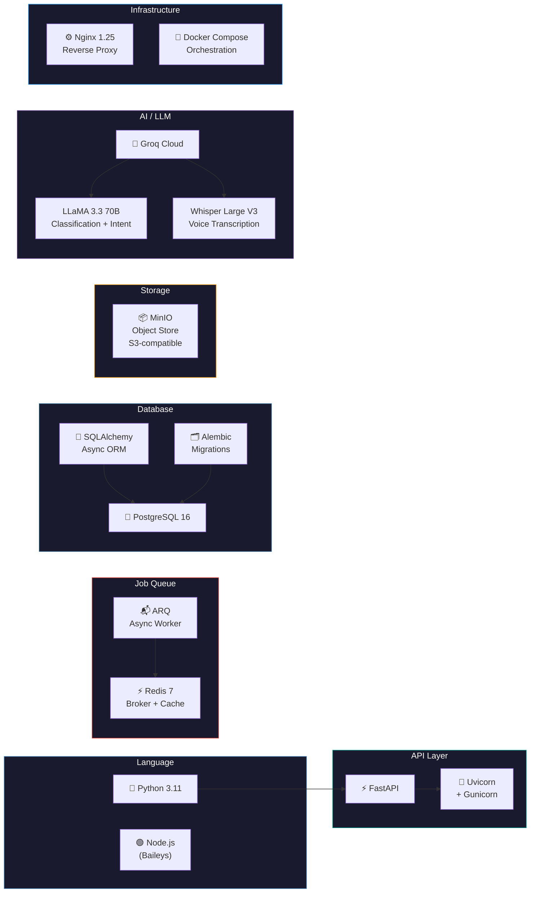

| Layer | Technology | Version | Purpose |
|---|---|---|---|
| **Language** | Python | 3.11 | Core backend |
| **API Framework** | FastAPI | Latest | Async HTTP server + webhook routing |
| **ASGI Server** | Uvicorn + Gunicorn | Latest | Production ASGI serving |
| **Task Queue** | ARQ | Latest | Async background job processing |
| **Message Broker** | Redis | 7 | Job queue backbone + caching |
| **Database** | PostgreSQL | 16 | Primary persistent data store |
| **ORM** | SQLAlchemy (Async) | 2.x | Database abstraction + query building |
| **Migrations** | Alembic | Latest | Schema versioning and migrations |
| **Object Storage** | MinIO | Latest | Voice notes + media files |
| **LLM Provider** | Groq | API | Fast LLaMA 3 inference |
| **LLM Model** | LLaMA 3.3 70B | Versatile | Classification + intent parsing |
| **STT Model** | Whisper Large V3 | via Groq | Voice note transcription |
| **WhatsApp Bridge** | Baileys | Node.js | WhatsApp multi-device WebSocket |
| **Proxy** | Nginx | 1.25 | Reverse proxy + ingress |
| **Containerization** | Docker Compose | v3.9 | Full stack orchestration |

---

## 📂 Folder Structure

```
ARIA/
│
├── 🐍 api/                              ← Python FastAPI Backend
│   │
│   ├── 🔌 adapters/                     ← Inbound Data Normalization
│   │   ├── gmail_adapter.py             │  Google Pub/Sub → ARIA Message
│   │   ├── slack_adapter.py             │  Slack Event API → ARIA Message
│   │   ├── discord_adapter.py           │  Discord Gateway → ARIA Message
│   │   ├── whatsapp_adapter.py          │  Baileys Payload → ARIA Message
│   │   └── sms_adapter.py              ─┘  SMS Gateway → ARIA Message
│   │
│   ├── ⚙️ core/                         ← Infrastructure & Config
│   │   ├── config.py                    │  Pydantic Settings (reads .env)
│   │   ├── redis.py                     │  ARQ Redis pool setup
│   │   └── logging.py                  ─┘  Structured JSON logging
│   │
│   ├── 🗄️ db/                           ← Database Layer
│   │   ├── models.py                    │  SQLAlchemy ORM models
│   │   ├── session.py                   │  Async session factory
│   │   └── migrations/                 ─┘  Alembic migration scripts
│   │       └── versions/
│   │
│   ├── 🎯 handlers/                     ← Intent Execution
│   │   ├── reply_handler.py             │  Cross-platform reply logic
│   │   ├── expense_handler.py           │  Financial tracking
│   │   ├── schedule_handler.py          │  Calendar management
│   │   ├── habit_handler.py             │  Habit + streak tracking
│   │   ├── reminder_handler.py          │  Scheduled reminders
│   │   ├── summary_handler.py           │  Data digest generation
│   │   └── briefing_handler.py         ─┘  Morning briefing assembly
│   │
│   ├── 🤖 llm/                          ← AI / LLM Layer
│   │   ├── classify.py                  │  Message importance scoring
│   │   ├── parse_intent.py              │  NL → structured JSON intent
│   │   ├── prompts.py                   │  All system/user prompt templates
│   │   └── whisper.py                  ─┘  Voice → text via Groq Whisper
│   │
│   ├── 🌐 routes/                       ← FastAPI Endpoint Definitions
│   │   ├── telegram.py                  │  /webhook/telegram
│   │   ├── gmail.py                     │  /webhook/gmail
│   │   ├── whatsapp.py                  │  /webhook/whatsapp
│   │   ├── slack.py                     │  /webhook/slack
│   │   ├── discord.py                   │  /webhook/discord
│   │   └── internal.py                 ─┘  /internal/trigger (cron)
│   │
│   ├── 🔧 services/                     ← External API Clients
│   │   ├── telegram_service.py          │  Send Telegram messages
│   │   ├── gmail_service.py             │  Read/send Gmail
│   │   ├── whatsapp_service.py          │  Send via Baileys bridge
│   │   ├── slack_service.py             │  Post to Slack
│   │   ├── discord_service.py           │  Send to Discord
│   │   ├── notion_service.py            │  Write to Notion DB
│   │   ├── github_service.py            │  GitHub API queries
│   │   ├── spotify_service.py           │  Spotify playback control
│   │   └── sms_service.py              ─┘  Send SMS
│   │
│   ├── ⚡ workers/                      ← Background Job Processors
│   │   ├── settings.py                  │  ARQ WorkerSettings config
│   │   ├── inbound_worker.py            │  process_inbound_message job
│   │   └── outbound_worker.py          ─┘  process_outbound_command job
│   │
│   ├── main.py                          ← FastAPI app factory + lifespan
│   └── Dockerfile                       ← API container build
│
├── 📱 baileys/                          ← Node.js WhatsApp Bridge
│   ├── index.js                         │  Baileys WA multi-device + Express
│   ├── package.json                     │
│   └── Dockerfile                      ─┘
│
├── 🔑 .env.example                      ← Environment variable template
├── 📋 alembic.ini                       ← Alembic migration config
├── 📧 aria_gmail_auth.py                ← Gmail OAuth setup wizard
├── 🔗 aria_register_webhook.py          ← Telegram webhook registration
├── 🚀 aria_setup.py                     ← Interactive .env generator
├── 🐳 docker-compose.yml                ← Full stack orchestration
└── 🔀 nginx.conf                        ← Reverse proxy config
```

---

## 🐳 Infrastructure — Docker Services

### Service Overview

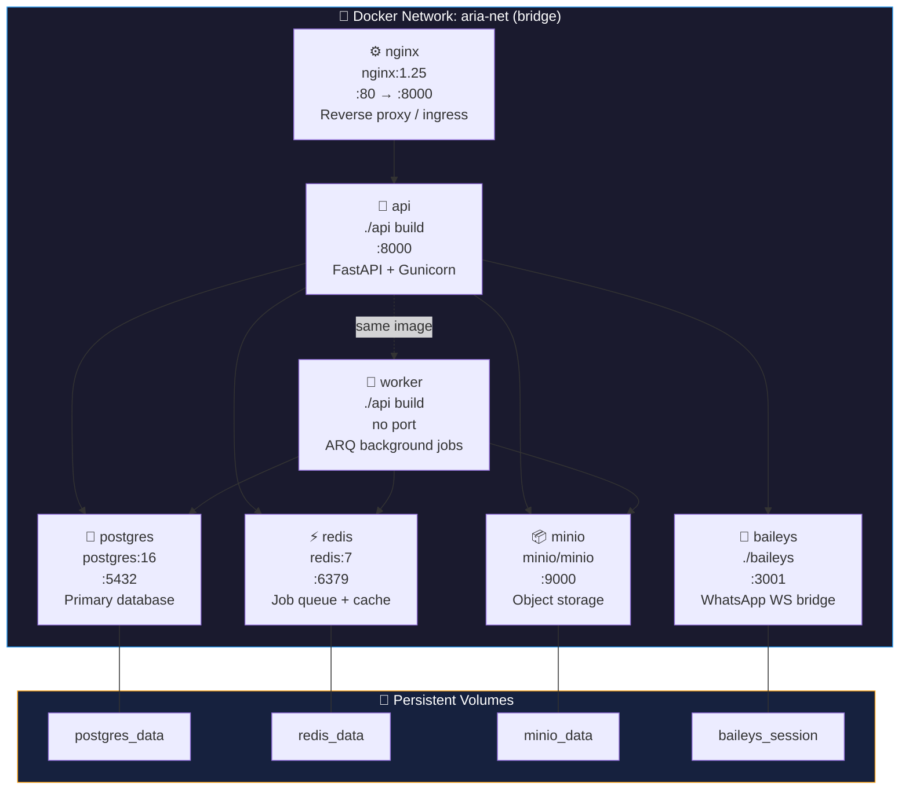

### Service Dependency Graph

```mermaid
graph TD
    NX["⚙️ nginx"] --> FA["🐍 api"]
    FA --> PG["🐘 postgres"]
    FA --> RD["⚡ redis"]
    FA --> MN["📦 minio"]
    FA --> BA["📱 baileys"]
    FA -.->|same build| WK["👷 worker"]
    WK --> PG & RD & MN

    style NX fill:#0f3460,color:#fff
    style FA fill:#009688,color:#fff
    style WK fill:#533483,color:#fff
    style PG fill:#336791,color:#fff
    style RD fill:#DC382D,color:#fff
    style MN fill:#f39c12,color:#000
    style BA fill:#27ae60,color:#fff
```

---

## 🚀 Quick Start

### Prerequisites

| Requirement | Details |
|---|---|
| 🐳 Docker & Docker Compose v2+ | Container orchestration |
| 📱 Telegram Bot Token | From [@BotFather](https://t.me/BotFather) |
| 🧠 Groq API Key | From [console.groq.com](https://console.groq.com) |
| 🌐 Public HTTPS URL | Ngrok free tier works perfectly |

---

### Step 1 — Clone & Configure

```bash
git clone https://github.com/aanandmodi/ARIA.git
cd ARIA

# 🪄 Run the interactive setup wizard (recommended)
python aria_setup.py

# OR manually copy and edit
cp .env.example .env
nano .env
```

> The setup wizard walks you through every config value interactively and auto-generates secure secrets.

---

### Step 2 — Start All Services

```bash
docker compose up -d
```

This spins up **7 containers**: `nginx`, `api`, `worker`, `baileys`, `postgres`, `redis`, `minio`.

---

### Step 3 — Expose & Register Webhook

```bash
# 1. Start a public tunnel
ngrok http 80
# → Copy the https://xxxx.ngrok-free.app URL

# 2. Register your webhook with Telegram
python aria_register_webhook.py
# → Paste your Ngrok URL when prompted
```

---

### Step 4 — Connect Integrations

**📱 WhatsApp:**
```bash
docker logs aria-baileys --follow
# → Scan the QR code with WhatsApp → Linked Devices
```

**📧 Gmail:**
```bash
python aria_gmail_auth.py
# → Follow the OAuth browser flow — saves refresh token to .env
```

**🔵 Discord / Slack:**
```bash
# Add bot tokens to .env and restart
docker compose restart api worker
```

---

### Step 5 — Start Using ARIA

Send `/start` to your Telegram bot. You're live. 🎉

```
You: remind me to call John tomorrow at 3pm
ARIA: ✅ Reminder set for tomorrow at 3:00 PM

You: what's my schedule today?
ARIA: 📅 Today's Schedule:
      • 10:00 AM — Team standup
      • 3:00 PM — Call John
      • 5:30 PM — Gym

You: professional: I'll need to reschedule our meeting
ARIA: ✅ Replied to Priya on WhatsApp:
      "I sincerely apologize, but I'll need to reschedule our meeting..."
```

---

## 🔧 Environment Variables

### 🔴 Required (Minimum to run)

| Variable | Description |
|---|---|
| `TELEGRAM_BOT_TOKEN` | Bot token from @BotFather |
| `TELEGRAM_USER_ID` | Your Telegram numeric user ID |
| `GROQ_API_KEY` | Groq cloud API key |

### 🤖 LLM Settings

| Variable | Default | Description |
|---|---|---|
| `GROQ_MODEL` | `llama-3.3-70b-versatile` | Text classification + intent model |
| `GROQ_WHISPER_MODEL` | `whisper-large-v3` | Voice transcription model |
| `IMPORTANCE_THRESHOLD` | `6` | Min score (1–10) to trigger notifications |
| `DRAFT_MODE` | `false` | If `true`, shows replies for approval before sending |

### 🐘 Database (Auto-configured for Docker)

| Variable | Default |
|---|---|
| `POSTGRES_DB` | `aria` |
| `POSTGRES_USER` | `aria` |
| `POSTGRES_HOST` | `postgres` |
| `REDIS_HOST` | `redis` |
| `MINIO_HOST` | `minio` |
| `MINIO_BUCKET` | `aria-storage` |

### 🔌 Integrations (All Optional)

| Variable | Service |
|---|---|
| `GMAIL_CLIENT_ID` / `SECRET` / `REFRESH_TOKEN` | Gmail OAuth |
| `DISCORD_BOT_TOKEN` | Discord |
| `SLACK_BOT_TOKEN` / `SIGNING_SECRET` | Slack |
| `NOTION_TOKEN` / `NOTES_DB_ID` / `TASKS_DB_ID` | Notion |
| `GITHUB_TOKEN` / `USERNAME` / `REPOS` | GitHub |
| `SPOTIFY_CLIENT_ID` / `SECRET` | Spotify |
| `SMS_GATEWAY_URL` / `TOKEN` | SMS |

### ⚙️ Preferences

| Variable | Default | Description |
|---|---|---|
| `BRIEFING_TIME` | `08:00` | Time for morning digest (HH:MM) |
| `TIMEZONE` | `Asia/Kolkata` | Your timezone |
| `FOLLOW_UP_DAYS` | `3` | Days before auto follow-up reminder |
| `LANGUAGE` | `en` | Response language |

---

## 🔄 How Each Piece Connects

```mermaid
flowchart TD
    EXT["🌍 External Services\n(WhatsApp, Gmail, Slack...)"]
    NX["⚙️ Nginx\nReverse Proxy"]
    FA["🐍 FastAPI\nWeb Server"]
    RD["⚡ Redis\nJob Queue"]
    WK["👷 ARQ Worker"]
    GQ["🧠 Groq LLM API\n(LLaMA 3 + Whisper)"]
    PG["🐘 PostgreSQL\nmessages · intents\nreminders · expenses\nhabits"]
    MN["📦 MinIO\nMedia Storage"]
    TG["📱 Telegram\nUser sees results"]

    EXT -->|HTTPS webhook| NX
    NX -->|Proxy :8000| FA
    FA -->|Enqueue jobs| RD
    RD -->|Poll jobs| WK
    WK -->|LLM calls| GQ
    WK -->|Read/Write| PG
    WK -->|Upload/Download| MN
    WK -->|Push notify| TG
    TG -->|User replies| FA
    FA -->|direct writes| PG

    style EXT fill:#e94560,color:#fff
    style NX fill:#0f3460,color:#fff
    style FA fill:#009688,color:#fff
    style RD fill:#DC382D,color:#fff
    style WK fill:#533483,color:#fff
    style GQ fill:#533483,color:#fff
    style PG fill:#336791,color:#fff
    style MN fill:#f39c12,color:#000
    style TG fill:#2b5278,color:#fff
```

### Data Flow Summary

| Step | From | To | Via | What Happens |
|:---:|---|---|---|---|
| **1** | External service | Nginx | HTTPS webhook | Message arrives |
| **2** | Nginx | FastAPI | Internal HTTP | Signature validated |
| **3** | FastAPI | Adapter | Function call | Payload normalized |
| **4** | FastAPI | Redis | ARQ enqueue | Job queued |
| **5** | Redis | ARQ Worker | Job poll | Worker picks up job |
| **6** | ARQ Worker | Groq API | HTTPS | Message classified |
| **7** | ARQ Worker | PostgreSQL | SQLAlchemy | Results persisted |
| **8** | ARQ Worker | MinIO | S3 API | Media stored |
| **9** | ARQ Worker | Telegram API | HTTPS | User notified |
| **10** | Telegram | FastAPI | Webhook | User replies |
| **11** | FastAPI | ARQ Worker | Redis queue | Command queued |
| **12** | ARQ Worker | Groq API | HTTPS | Intent parsed |
| **13** | ARQ Worker | Handler | Function call | Action dispatched |
| **14** | Handler | External service | Service API | Action executed |
| **15** | Handler | Telegram | HTTPS | Confirmation sent |

---

##  Gotchas & Production Troubleshooting Guide

### 1. 📱 WhatsApp: "Sent successfully" but not showing up on target phone
* **Reason:** The target contact in the database is saved under an **LID namespace** (13, 14, or 15-digit number) but was incorrectly qualified with `@s.whatsapp.net`. The message went into a black hole!
* **Solution:** Run the automatic contact synchronization script:
  ```bash
  docker exec -it aria-worker python api/scripts/sync_whatsapp_contacts.py
  ```
  This will query Baileys and resolve all contact numbers to their true namespaces in PostgreSQL. ARIA will now automatically use the `@lid` qualifier!

### 2. 🐙 GitHub: "Failed to fetch commits" with 404 Error
* **Reason:** When you ask *"whats the last commit of ARIA repo?"*, the LLM extracts the repository name as `"ARIA repo"`, expanding to `"Aanandmodi/ARIA repo"`. This returns a 404 since the repo on GitHub is named `"Aanandmodi/ARIA"`.
* **Solution:** ARIA has an automatic suffix-cleanup loop implemented. Verify that the repository configuration in your `.env` does not contain conversational terms:
  ```bash
  # Check your GITHUB_REPOS value in .env
  GITHUB_REPOS=Aanandmodi/ARIA
  ```

### 3. 🚨 LLM Wrapper Signature crash (TypeError)
* **Reason:** Custom model properties like `max_tokens` or `temperature` were passed but not supported by the underlying client wrapper method, causing intent parsing to fail silently.
* **Solution:** Patch has been fully deployed. Ensure your FastAPI/Worker containers are restarted to load the latest client patches:
  ```bash
  docker compose restart api worker
  ```

---

## 🤝 Contributing

Contributions are warmly welcome! Here's how to get started:

```bash
# 1. Fork the repository on GitHub

# 2. Create your feature branch
git checkout -b feature/add-new-integration

# 3. Add your integration
#    → api/services/    (new API client)
#    → api/adapters/    (new inbound normalizer)
#    → api/handlers/    (new intent handler)
#    → .env.example     (new config vars)

# 4. Test locally
docker compose up -d
python aria_register_webhook.py

# 5. Open a Pull Request 🎉
```

### Areas for Contribution

| Area | Description |
|---|---|
| 🔌 **New Integrations** | Linear, Jira, Trello, Obsidian, etc. |
| 🧠 **LLM Prompt Tuning** | Better classification + intent accuracy |
| 📊 **Web Dashboard** | Message history visualization UI |
| 📱 **Mobile Admin** | Mobile-friendly management interface |
| 🌍 **i18n Support** | Additional language support |
| 🧪 **Tests** | Unit and integration test coverage |

---

<div align="center">

---

### Built with ❤️ by [Aanand Modi](https://github.com/aanandmodi)

*ARIA is MIT licensed. Your data stays on your machine. Always.*

[](https://github.com/aanandmodi/ARIA)
[](https://github.com/aanandmodi/ARIA)
[](./LICENSE)

</div>
