<div align="center">

```
 █████╗ ██████╗ ██╗ █████╗
██╔══██╗██╔══██╗██║██╔══██╗
███████║██████╔╝██║███████║
██╔══██║██╔══██╗██║██╔══██║
██║  ██║██║  ██║██║██║  ██║
╚═╝  ╚═╝╚═╝  ╚═╝╚═╝╚═╝  ╚═╝
```

# ✦ ARIA - Autonomous Reply & Intelligence Assistant

### *Your entire digital life. One Telegram chat. Zero context switching.*

<br/>

[](https://python.org)
[](https://fastapi.tiangolo.com)
[](https://www.postgresql.org)
[](https://redis.io)
[](https://docker.com)
[](https://groq.com)
[](https://nodejs.org)
[](./LICENSE)
[](https://github.com/aanandmodi/ARIA)

<br/>

> *"Instead of jumping between WhatsApp, Gmail, Slack, Discord, Spotify, Notion, and GitHub -*
> *ARIA brings everything to one place: your Telegram chat."*

<br/>

---

</div>

## 📑 Table of Contents

- [🧠 Abstract](#-abstract)
- [💡 The Problem ARIA Solves](#-the-problem-aria-solves)
- [✨ Key Features](#-key-features)
- [🏗 System Architecture](#-system-architecture)
- [🔬 Component Deep Dive](#-component-deep-dive)
  - [Nginx — Ingress](#1-nginx--reverse-proxy--ingress)
  - [FastAPI Server](#2-fastapi-server-api)
  - [ARQ Task Worker](#3-arq-task-worker-apiworkers)
  - [Baileys Bridge](#4-baileys-whatsapp-bridge-baileys)
  - [Groq LLM Engine](#5-groq-llm-engine-apillm)
  - [Handlers](#6-handlers-apihandlers)
  - [Services](#7-services-apiservices)
- [🤖 LLM Pipeline](#-llm-pipeline--how-intelligence-works)
- [🗄 Database Architecture](#-database-architecture--pipeline)
- [📥 Inbound Communication Flow](#-communication-flow--inbound)
- [📤 Outbound Command Flow](#-communication-flow--outbound)
- [🔗 Integration Map](#-integration-map)
- [🛠 Tech Stack](#-tech-stack)
- [📂 Folder Structure](#-folder-structure)
- [🐳 Docker Infrastructure](#-infrastructure--docker-services)
- [🚀 Quick Start](#-quick-start)
- [🔧 Environment Variables](#-environment-variables)
- [🔄 Full Connection Map](#-how-each-piece-connects)
- [🤝 Area of Contribution](#-area-of-contribution)


---

## 🧠 Abstract

**ARIA** *(Autonomous Reply & Intelligence Assistant)* is a self-hosted, multi-agent AI backend that eliminates digital context-switching. It acts as a **bidirectional intelligence bridge** between you and your entire digital ecosystem.

At its core, ARIA is a **webhook-ingestion + intent-parsing engine**:

| Step | What ARIA Does |
|:----:|----------------|
| **①** | **Receives** events from Gmail, WhatsApp, Slack, Discord, and SMS |
| **②** | **Classifies** every message with Groq LLaMA 3 — scoring urgency, importance & tone |
| **③** | **Filters** noise — only messages above your `IMPORTANCE_THRESHOLD` alert you |
| **④** | **Routes** your Telegram commands through an intent parser to the right service |
| **⑤** | **Persists** everything — messages, intents, expenses, habits — in PostgreSQL |

> The result: a single Telegram bot that manages your entire digital life, powered by a real LLM, running entirely on your own hardware.

---

## 💡 The Problem ARIA Solves

<table>
<tr>
<td width="50%">

### ❌ Without ARIA

```
📱 WhatsApp  → open app
📧 Gmail     → open app
💬 Slack     → open app
🎮 Discord   → open app
📓 Notion    → open browser
🎵 Spotify   → open app
💻 GitHub    → open browser
📊 Finances  → spreadsheet

  ╔══════════════════════╗
  ║  8 apps to manage    ║
  ║  Constant switching  ║
  ║  Hours lost daily    ║
  ╚══════════════════════╝
```

</td>
<td width="50%">

### ✅ With ARIA

```
🤖 Telegram Bot  (1 interface)
│
├── 📩 WhatsApp messages
├── 📧 Gmail (scored & triaged)
├── 💬 Slack threads
├── 🎮 Discord DMs
├── 📓 Notion tasks
├── 🎵 Spotify controls
├── 💰 Expense tracking
└── 📅 Calendar & reminders

  ╔══════════════════════╗
  ║  0 context switches  ║
  ║  1 unified interface ║
  ║  AI does the work    ║
  ╚══════════════════════╝
```

</td>
</tr>
</table>

---

## ✨ Key Features

<table>
<tr><th>Feature</th><th>Description</th></tr>
<tr><td>🗂 <b>Unified Smart Inbox</b></td><td>Gmail, WhatsApp, Discord, Slack, SMS → one Telegram chat</td></tr>
<tr><td>🧮 <b>AI Importance Scoring</b></td><td>Every message scored 1–10 for urgency; only high-priority ones alert you</td></tr>
<tr><td>✍️ <b>Tone-Aware Replies</b></td><td>Prefix with <code>professional:</code> or <code>casual:</code> — ARIA reformats for the target platform</td></tr>
<tr><td>🎙 <b>Voice Note Transcription</b></td><td>Inbound voice messages auto-transcribed via Groq Whisper</td></tr>
<tr><td>🌅 <b>Morning Briefing</b></td><td>Daily digest: weather + calendar + urgent emails + stocks/crypto + HN stories</td></tr>
<tr><td>💬 <b>Natural Language Commands</b></td><td>"Remind me to call John tomorrow", "Log $50 food expense", "What's my schedule?"</td></tr>
<tr><td>📊 <b>Expense Tracking</b></td><td>Log and summarize financial transactions via natural language</td></tr>
<tr><td>✅ <b>Habit Tracking</b></td><td>Track daily habits and receive streak reminders</td></tr>
<tr><td>🔔 <b>Keyword Alerts</b></td><td>Monitor RSS feeds and any source for specific keywords</td></tr>
<tr><td>🔒 <b>Privacy First</b></td><td>100% self-hosted. No cloud services own your data. PostgreSQL stays on your machine</td></tr>
<tr><td>🐳 <b>One-Command Deploy</b></td><td>Full <code>docker compose up -d</code> setup with zero manual config</td></tr>
</table>

---

## 🏗 System Architecture

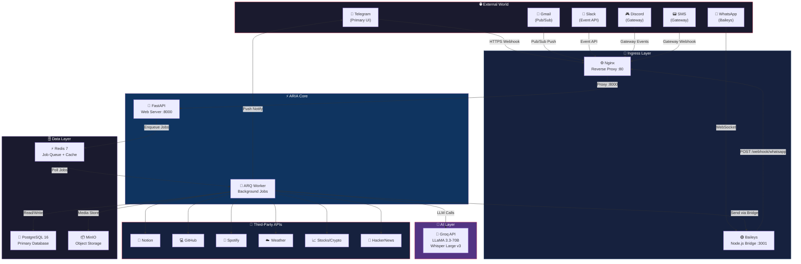

---

## 🔬 Component Deep Dive

### 1. Nginx — Reverse Proxy / Ingress

Nginx is the **single public-facing door** to ARIA. It terminates HTTPS, routes webhook requests, and rate-limits traffic.

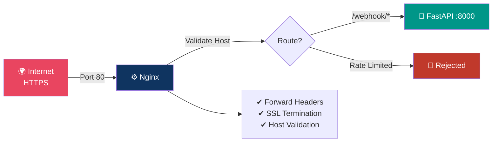

**Config file:** `nginx.conf`

---

### 2. FastAPI Server (`api/`)

The brain of ARIA's request handling.

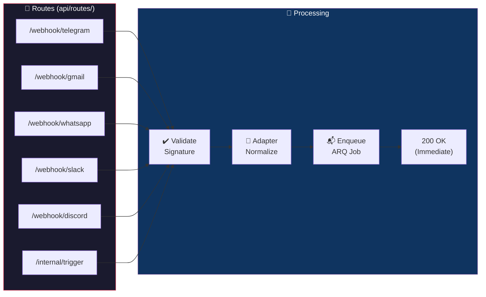

---

### 3. ARQ Task Worker (`api/workers/`)

The async **workhorse** that processes every job from Redis.

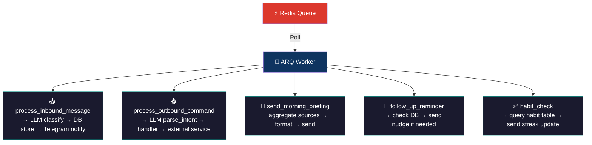

---

### 4. Baileys WhatsApp Bridge (`baileys/`)

A dedicated **Node.js / Express** microservice maintaining the WhatsApp Web multi-device WebSocket session.

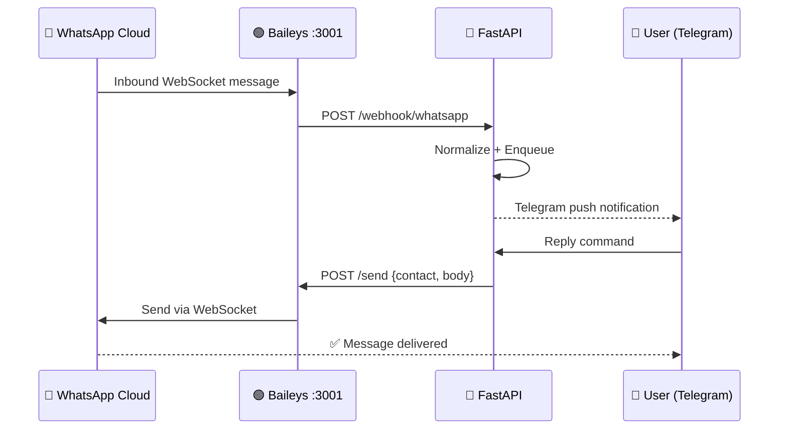

**Key files:** `baileys/index.js`, `baileys/Dockerfile`

#### 📱 WhatsApp JID Namespace & Companion LID Resolution Heuristic
WhatsApp personal contact routing has a highly complex, protocol-level division that standard bridges fail to support:
* **Standard JIDs (`@s.whatsapp.net`):** Normal phone accounts (e.g. `918829095225@s.whatsapp.net`).
* **LID JIDs (`@lid`):** WhatsApp's companion device/hidden identifiers (e.g. `38302585458926@lid`).
* **Group JIDs (`@g.us`):** Group channels (e.g. `120363422974535988@g.us`).

If you attempt to send an LID message using `@s.whatsapp.net`, the WhatsApp server silently discards it into a black hole! 

To solve this, ARIA implements a **mathematical JID length-and-prefix resolution heuristic** right in the handler layer:

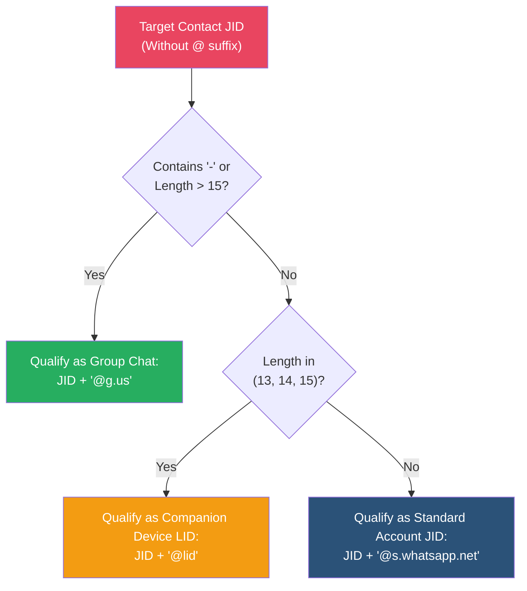

##### JID Namespace Comparison Table

| Format | Length (digits) | Prefix Characteristics | Suffix Appended | Delivery Namespace |
| :--- | :---: | :--- | :---: | :--- |
| **Standard Phone** | Exactly 12 | Starts with Country Code (e.g. `91` for India) | `@s.whatsapp.net` | Standard Chat |
| **Companion LID** | 13, 14, or 15 | Starts with companion nodes (`18`, `27`, `38`, `95`) | `@lid` | Companion/Hidden Account |
| **Group Chat** | > 15 | Starts with `1203` | `@g.us` | Group Threads |

---

### 5. Groq LLM Engine (`api/llm/`)

ARIA uses **two Groq models** for different tasks:

| Model | Task | Max Tokens |
|-------|------|-----------|
| `llama-3.3-70b-versatile` | Classification, intent parsing, reply reformatting | ~200 |
| `whisper-large-v3` | Voice note transcription | — |

**`classify(message)`** — Returns structured importance scoring:

```json
{
  "importance": 8,
  "urgency": "high",
  "summary": "Client asking for invoice by EOD",
  "tone": "professional",
  "suggested_reply": "I'll send it over within the hour."
}
```

**`parse_intent(command)`** — Converts natural language to a structured action:

```json
{
  "intent": "reply",
  "platform": "whatsapp",
  "contact": "John",
  "tone": "casual",
  "body": "Sure, see you at 6!"
}
```

---

### 6. Handlers (`api/handlers/`)

Each parsed intent maps to a dedicated handler:

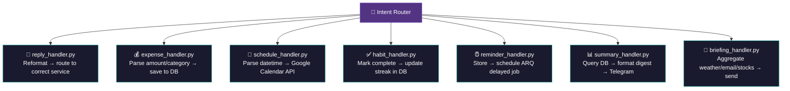

---

### 7. Services (`api/services/`)

Thin API client wrappers for each external platform:

| Service File | External API | Auth Method | Direction |
|---|---|---|---|
| `telegram_service.py` | Telegram Bot API | Bot Token | Bidirectional |
| `gmail_service.py` | Google Gmail API | OAuth 2.0 Refresh Token | Bidirectional |
| `whatsapp_service.py` | Baileys REST | Internal HTTP | Bidirectional |
| `slack_service.py` | Slack Web API | Bot Token | Bidirectional |
| `discord_service.py` | Discord Bot API | Bot Token | Bidirectional |
| `notion_service.py` | Notion API | Integration Token | Write only |
| `github_service.py` | GitHub REST API | Personal Access Token | Read only |
| `spotify_service.py` | Spotify Web API | OAuth 2.0 | Bidirectional |
| `sms_service.py` | SMS Gateway | API Token | Bidirectional |

---

## 🤖 LLM Pipeline — How Intelligence Works

### 📥 Inbound Classification Pipeline

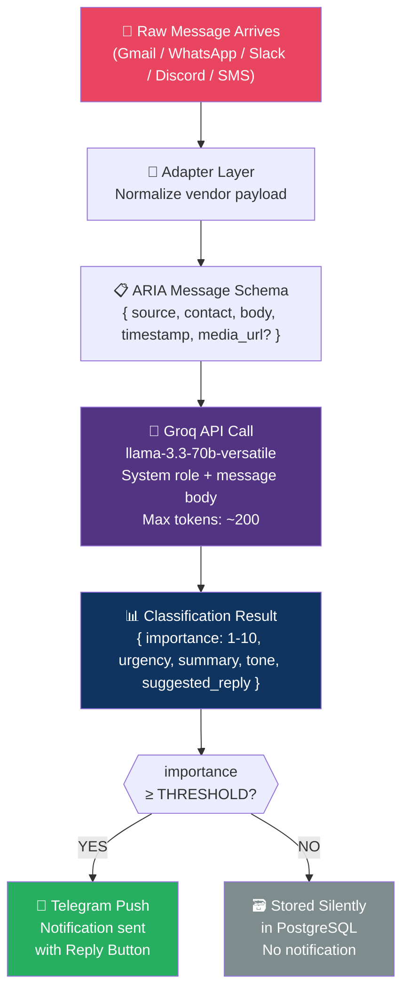

### 📤 Outbound Intent Pipeline

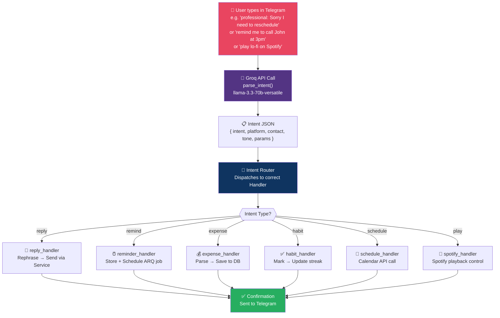

### 🎙 Voice Note Pipeline

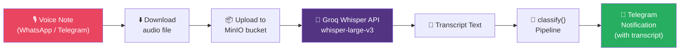

### 🔄 Context-Aware NLU Pipeline (Sliding Window Classifier)

Standard chatbots suffer from context dropouts on short replies (e.g. you say `"yes"`, `"do it"`, or `"hi"` and the bot defaults to generic conversational chatter). 

ARIA implements a **V2 Context-Aware Sliding Window Intent Classifier** (`intent_unified.py`) that formats and injects the last 3 conversation turns from your Telegram Redis cache directly into the system prompt. This allows LLaMA 3.3 to resolve vague pronouns and follow-up replies perfectly.

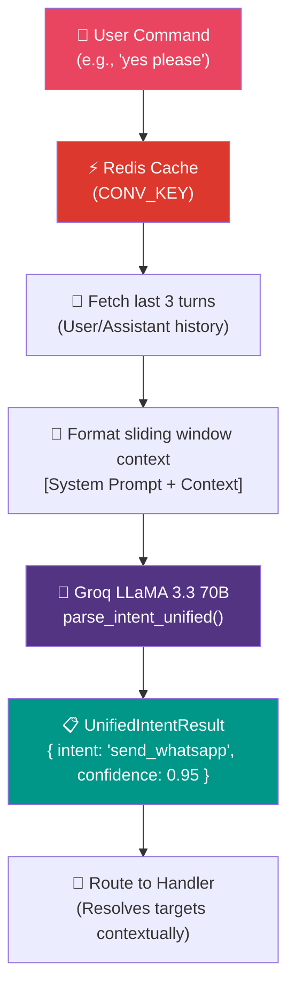

### 🐙 GitHub Watcher & Monitored Repository Watcher Pipeline

ARIA keeps you updated on your codebase asynchronously using a highly optimized background cron task worker:

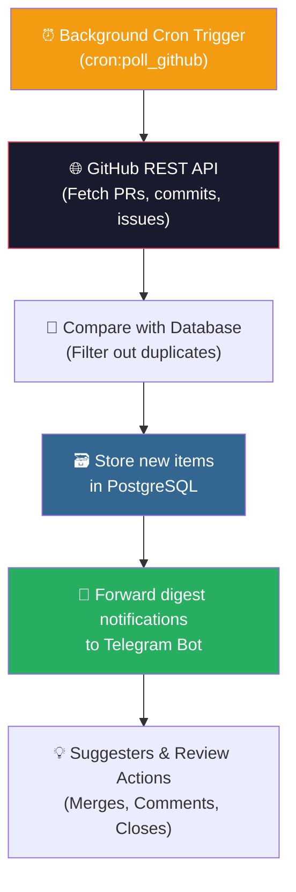

---

## 🗄 Database Architecture & Pipeline

ARIA uses **PostgreSQL 16** with **SQLAlchemy Async ORM**. Migrations managed by **Alembic**.

### Entity Relationship Diagram


### Database Write Pipeline

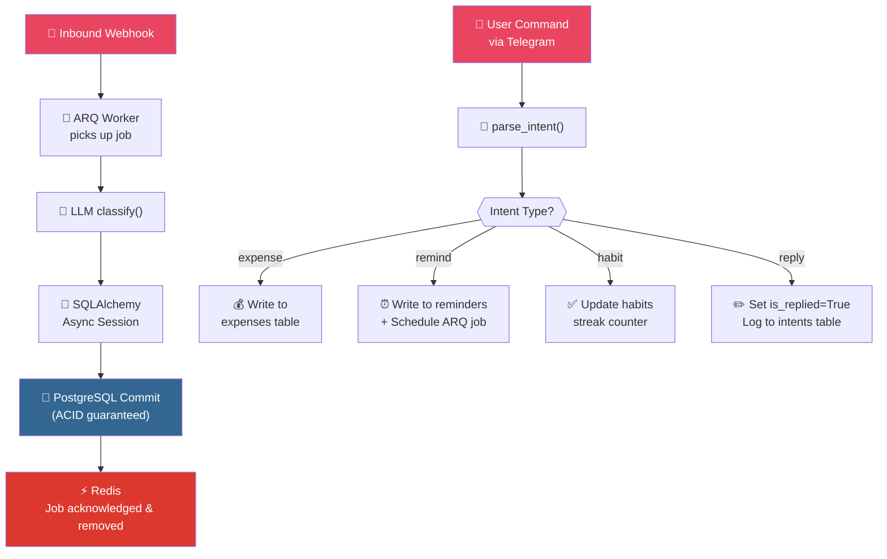

### Alembic Migration Pipeline

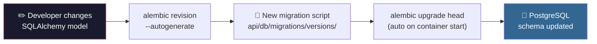

---

## 📥 Communication Flow — Inbound

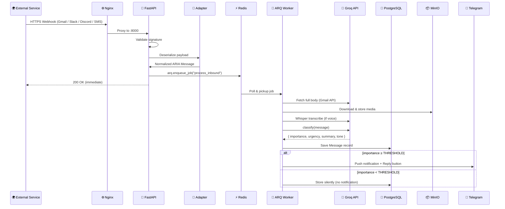

---

## 📤 Communication Flow — Outbound

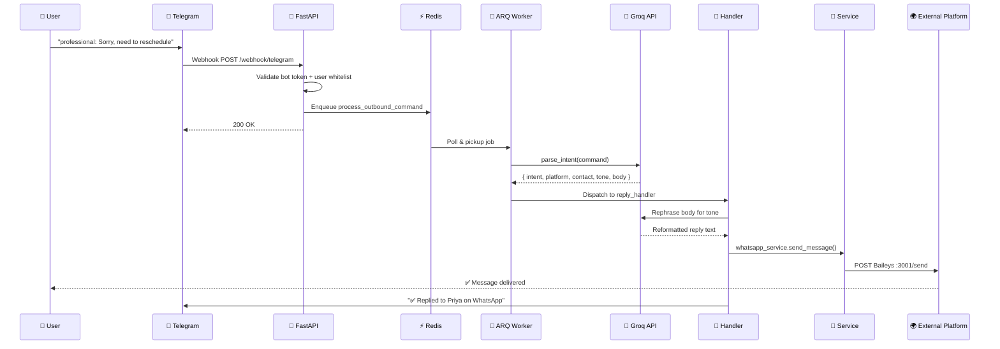

---

## 🔗 Integration Map

```mermaid
graph TB
    CORE["⚡ ARIA CORE\nFastAPI + ARQ Worker"]

    subgraph MSG["💬 Messaging"]
        TG["📱 Telegram\nPrimary UI"]
        WA["💬 WhatsApp\nBaileys Bridge"]
        SL["🔵 Slack\nBot Token"]
        DC["🎮 Discord\nBot Token"]
        SM["📟 SMS\nGateway"]
    end

    subgraph PROD["📋 Productivity"]
        GM["📧 Gmail\nOAuth 2.0"]
        NT["📓 Notion\nTasks + Notes"]
        GH["💻 GitHub\nRepo Watch"]
        SP["🎵 Spotify\nPlayback"]
        CA["📅 Calendar\nGoogle Cal"]
    end

    subgraph MON["📊 Monitoring"]
        ST["📈 Stocks\nCrypto Watch"]
        WE["☁️ Weather\nAPI"]
        HN["📰 HackerNews\nRSS"]
        RS["🔔 RSS Feeds\nKeyword Alerts"]
    end

    CORE <--> TG & WA & SL & DC & SM
    CORE <--> GM & NT & GH & SP & CA
    CORE --> ST & WE & HN & RS

    style CORE fill:#533483,color:#fff
    style MSG fill:#1a1a2e,stroke:#e94560,color:#fff
    style PROD fill:#1a1a2e,stroke:#009688,color:#fff
    style MON fill:#1a1a2e,stroke:#f39c12,color:#fff
```

### Integration Authentication Reference

| Integration | Auth Type | Direction | Setup |
|---|---|---|---|
| **Telegram** | Bot Token + Webhook Secret | Bidirectional | `aria_register_webhook.py` |
| **Gmail** | OAuth 2.0 offline refresh token | Bidirectional | `aria_gmail_auth.py` |
| **WhatsApp** | QR Code → Session file | Bidirectional | `docker logs aria-baileys` |
| **Slack** | Bot Token + Signing Secret | Bidirectional | `.env` config |
| **Discord** | Bot Token | Bidirectional | `.env` config |
| **Notion** | Integration Token | Write only | `.env` config |
| **GitHub** | Personal Access Token | Read only | `.env` config |
| **Spotify** | OAuth 2.0 | Bidirectional | `.env` config |
| **SMS** | Gateway API Token | Bidirectional | `.env` config |

---

## 🛠 Tech Stack

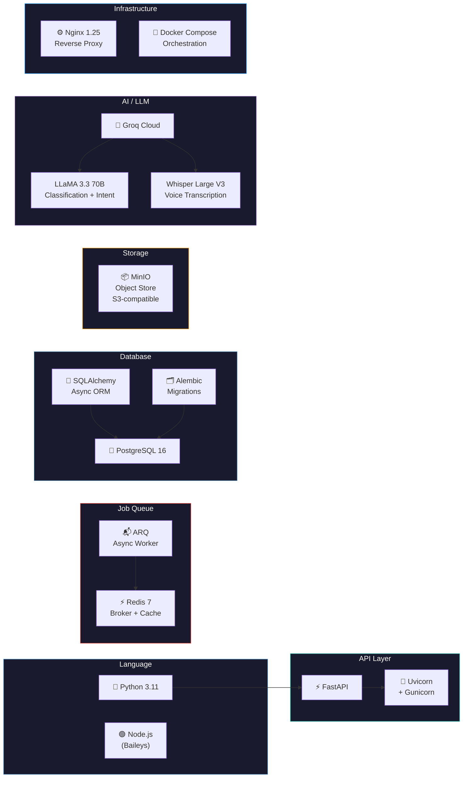

| Layer | Technology | Version | Purpose |
|---|---|---|---|
| **Language** | Python | 3.11 | Core backend |
| **API Framework** | FastAPI | Latest | Async HTTP server + webhook routing |
| **ASGI Server** | Uvicorn + Gunicorn | Latest | Production ASGI serving |
| **Task Queue** | ARQ | Latest | Async background job processing |
| **Message Broker** | Redis | 7 | Job queue backbone + caching |
| **Database** | PostgreSQL | 16 | Primary persistent data store |
| **ORM** | SQLAlchemy (Async) | 2.x | Database abstraction + query building |
| **Migrations** | Alembic | Latest | Schema versioning and migrations |
| **Object Storage** | MinIO | Latest | Voice notes + media files |
| **LLM Provider** | Groq | API | Fast LLaMA 3 inference |
| **LLM Model** | LLaMA 3.3 70B | Versatile | Classification + intent parsing |
| **STT Model** | Whisper Large V3 | via Groq | Voice note transcription |
| **WhatsApp Bridge** | Baileys | Node.js | WhatsApp multi-device WebSocket |
| **Proxy** | Nginx | 1.25 | Reverse proxy + ingress |
| **Containerization** | Docker Compose | v3.9 | Full stack orchestration |

---

## 📂 Folder Structure

```
ARIA/
│
├── 🐍 api/                              ← Python FastAPI Backend
│   │
│   ├── 🔌 adapters/                     ← Inbound Data Normalization
│   │   ├── gmail_adapter.py             │  Google Pub/Sub → ARIA Message
│   │   ├── slack_adapter.py             │  Slack Event API → ARIA Message
│   │   ├── discord_adapter.py           │  Discord Gateway → ARIA Message
│   │   ├── whatsapp_adapter.py          │  Baileys Payload → ARIA Message
│   │   └── sms_adapter.py              ─┘  SMS Gateway → ARIA Message
│   │
│   ├── ⚙️ core/                         ← Infrastructure & Config
│   │   ├── config.py                    │  Pydantic Settings (reads .env)
│   │   ├── redis.py                     │  ARQ Redis pool setup
│   │   └── logging.py                  ─┘  Structured JSON logging
│   │
│   ├── 🗄️ db/                           ← Database Layer
│   │   ├── models.py                    │  SQLAlchemy ORM models
│   │   ├── session.py                   │  Async session factory
│   │   └── migrations/                 ─┘  Alembic migration scripts
│   │       └── versions/
│   │
│   ├── 🎯 handlers/                     ← Intent Execution
│   │   ├── reply_handler.py             │  Cross-platform reply logic
│   │   ├── expense_handler.py           │  Financial tracking
│   │   ├── schedule_handler.py          │  Calendar management
│   │   ├── habit_handler.py             │  Habit + streak tracking
│   │   ├── reminder_handler.py          │  Scheduled reminders
│   │   ├── summary_handler.py           │  Data digest generation
│   │   └── briefing_handler.py         ─┘  Morning briefing assembly
│   │
│   ├── 🤖 llm/                          ← AI / LLM Layer
│   │   ├── classify.py                  │  Message importance scoring
│   │   ├── parse_intent.py              │  NL → structured JSON intent
│   │   ├── prompts.py                   │  All system/user prompt templates
│   │   └── whisper.py                  ─┘  Voice → text via Groq Whisper
│   │
│   ├── 🌐 routes/                       ← FastAPI Endpoint Definitions
│   │   ├── telegram.py                  │  /webhook/telegram
│   │   ├── gmail.py                     │  /webhook/gmail
│   │   ├── whatsapp.py                  │  /webhook/whatsapp
│   │   ├── slack.py                     │  /webhook/slack
│   │   ├── discord.py                   │  /webhook/discord
│   │   └── internal.py                 ─┘  /internal/trigger (cron)
│   │
│   ├── 🔧 services/                     ← External API Clients
│   │   ├── telegram_service.py          │  Send Telegram messages
│   │   ├── gmail_service.py             │  Read/send Gmail
│   │   ├── whatsapp_service.py          │  Send via Baileys bridge
│   │   ├── slack_service.py             │  Post to Slack
│   │   ├── discord_service.py           │  Send to Discord
│   │   ├── notion_service.py            │  Write to Notion DB
│   │   ├── github_service.py            │  GitHub API queries
│   │   ├── spotify_service.py           │  Spotify playback control
│   │   └── sms_service.py              ─┘  Send SMS
│   │
│   ├── ⚡ workers/                      ← Background Job Processors
│   │   ├── settings.py                  │  ARQ WorkerSettings config
│   │   ├── inbound_worker.py            │  process_inbound_message job
│   │   └── outbound_worker.py          ─┘  process_outbound_command job
│   │
│   ├── main.py                          ← FastAPI app factory + lifespan
│   └── Dockerfile                       ← API container build
│
├── 📱 baileys/                          ← Node.js WhatsApp Bridge
│   ├── index.js                         │  Baileys WA multi-device + Express
│   ├── package.json                     │
│   └── Dockerfile                      ─┘
│
├── 🔑 .env.example                      ← Environment variable template
├── 📋 alembic.ini                       ← Alembic migration config
├── 📧 aria_gmail_auth.py                ← Gmail OAuth setup wizard
├── 🔗 aria_register_webhook.py          ← Telegram webhook registration
├── 🚀 aria_setup.py                     ← Interactive .env generator
├── 🐳 docker-compose.yml                ← Full stack orchestration
└── 🔀 nginx.conf                        ← Reverse proxy config
```

---

## 🐳 Infrastructure — Docker Services

### Service Overview

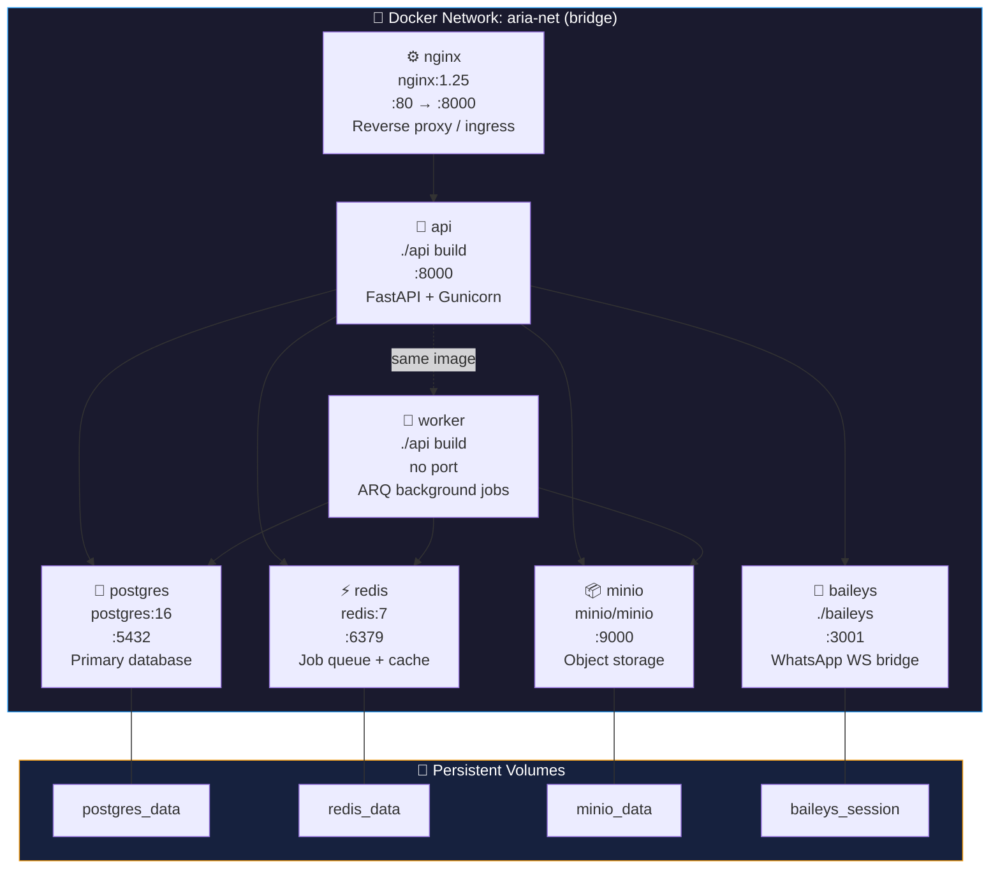

### Service Dependency Graph

```mermaid
graph TD
    NX["⚙️ nginx"] --> FA["🐍 api"]
    FA --> PG["🐘 postgres"]
    FA --> RD["⚡ redis"]
    FA --> MN["📦 minio"]
    FA --> BA["📱 baileys"]
    FA -.->|same build| WK["👷 worker"]
    WK --> PG & RD & MN

    style NX fill:#0f3460,color:#fff
    style FA fill:#009688,color:#fff
    style WK fill:#533483,color:#fff
    style PG fill:#336791,color:#fff
    style RD fill:#DC382D,color:#fff
    style MN fill:#f39c12,color:#000
    style BA fill:#27ae60,color:#fff
```

---

## 🚀 Quick Start

### Prerequisites

| Requirement | Details |
|---|---|
| 🐳 Docker & Docker Compose v2+ | Container orchestration |
| 📱 Telegram Bot Token | From [@BotFather](https://t.me/BotFather) |
| 🧠 Groq API Key | From [console.groq.com](https://console.groq.com) |
| 🌐 Public HTTPS URL | Ngrok free tier works perfectly |

---

### Step 1 — Clone & Configure

```bash
git clone https://github.com/aanandmodi/ARIA.git
cd ARIA

# 🪄 Run the interactive setup wizard (recommended)
python aria_setup.py

# OR manually copy and edit
cp .env.example .env
nano .env
```

> The setup wizard walks you through every config value interactively and auto-generates secure secrets.

---

### Step 2 — Start All Services

```bash
docker compose up -d
```

This spins up **7 containers**: `nginx`, `api`, `worker`, `baileys`, `postgres`, `redis`, `minio`.

---

### Step 3 — Expose & Register Webhook

```bash
# 1. Start a public tunnel
ngrok http 80
# → Copy the https://xxxx.ngrok-free.app URL

# 2. Register your webhook with Telegram
python aria_register_webhook.py
# → Paste your Ngrok URL when prompted
```

---

### Step 4 — Connect Integrations

**📱 WhatsApp:**
```bash
docker logs aria-baileys --follow
# → Scan the QR code with WhatsApp → Linked Devices
```

**📧 Gmail:**
```bash
python aria_gmail_auth.py
# → Follow the OAuth browser flow — saves refresh token to .env
```

**🔵 Discord / Slack:**
```bash
# Add bot tokens to .env and restart
docker compose restart api worker
```

---

### Step 5 — Start Using ARIA

Send `/start` to your Telegram bot. You're live. 🎉

```
You: remind me to call John tomorrow at 3pm
ARIA: ✅ Reminder set for tomorrow at 3:00 PM

You: what's my schedule today?
ARIA: 📅 Today's Schedule:
      • 10:00 AM — Team standup
      • 3:00 PM — Call John
      • 5:30 PM — Gym

You: professional: I'll need to reschedule our meeting
ARIA: ✅ Replied to Priya on WhatsApp:
      "I sincerely apologize, but I'll need to reschedule our meeting..."
```

---

## 🔧 Environment Variables

### 🔴 Required (Minimum to run)

| Variable | Description |
|---|---|
| `TELEGRAM_BOT_TOKEN` | Bot token from @BotFather |
| `TELEGRAM_USER_ID` | Your Telegram numeric user ID |
| `GROQ_API_KEY` | Groq cloud API key |

### 🤖 LLM Settings

| Variable | Default | Description |
|---|---|---|
| `GROQ_MODEL` | `llama-3.3-70b-versatile` | Text classification + intent model |
| `GROQ_WHISPER_MODEL` | `whisper-large-v3` | Voice transcription model |
| `IMPORTANCE_THRESHOLD` | `6` | Min score (1–10) to trigger notifications |
| `DRAFT_MODE` | `false` | If `true`, shows replies for approval before sending |

### 🐘 Database (Auto-configured for Docker)

| Variable | Default |
|---|---|
| `POSTGRES_DB` | `aria` |
| `POSTGRES_USER` | `aria` |
| `POSTGRES_HOST` | `postgres` |
| `REDIS_HOST` | `redis` |
| `MINIO_HOST` | `minio` |
| `MINIO_BUCKET` | `aria-storage` |

### 🔌 Integrations (All Optional)

| Variable | Service |
|---|---|
| `GMAIL_CLIENT_ID` / `SECRET` / `REFRESH_TOKEN` | Gmail OAuth |
| `DISCORD_BOT_TOKEN` | Discord |
| `SLACK_BOT_TOKEN` / `SIGNING_SECRET` | Slack |
| `NOTION_TOKEN` / `NOTES_DB_ID` / `TASKS_DB_ID` | Notion |
| `GITHUB_TOKEN` / `USERNAME` / `REPOS` | GitHub |
| `SPOTIFY_CLIENT_ID` / `SECRET` | Spotify |
| `SMS_GATEWAY_URL` / `TOKEN` | SMS |

### ⚙️ Preferences

| Variable | Default | Description |
|---|---|---|
| `BRIEFING_TIME` | `08:00` | Time for morning digest (HH:MM) |
| `TIMEZONE` | `Asia/Kolkata` | Your timezone |
| `FOLLOW_UP_DAYS` | `3` | Days before auto follow-up reminder |
| `LANGUAGE` | `en` | Response language |

---

## 🔄 How Each Piece Connects

```mermaid
flowchart TD
    EXT["🌍 External Services\n(WhatsApp, Gmail, Slack...)"]
    NX["⚙️ Nginx\nReverse Proxy"]
    FA["🐍 FastAPI\nWeb Server"]
    RD["⚡ Redis\nJob Queue"]
    WK["👷 ARQ Worker"]
    GQ["🧠 Groq LLM API\n(LLaMA 3 + Whisper)"]
    PG["🐘 PostgreSQL\nmessages · intents\nreminders · expenses\nhabits"]
    MN["📦 MinIO\nMedia Storage"]
    TG["📱 Telegram\nUser sees results"]

    EXT -->|HTTPS webhook| NX
    NX -->|Proxy :8000| FA
    FA -->|Enqueue jobs| RD
    RD -->|Poll jobs| WK
    WK -->|LLM calls| GQ
    WK -->|Read/Write| PG
    WK -->|Upload/Download| MN
    WK -->|Push notify| TG
    TG -->|User replies| FA
    FA -->|direct writes| PG

    style EXT fill:#e94560,color:#fff
    style NX fill:#0f3460,color:#fff
    style FA fill:#009688,color:#fff
    style RD fill:#DC382D,color:#fff
    style WK fill:#533483,color:#fff
    style GQ fill:#533483,color:#fff
    style PG fill:#336791,color:#fff
    style MN fill:#f39c12,color:#000
    style TG fill:#2b5278,color:#fff
```

### Data Flow Summary

| Step | From | To | Via | What Happens |
|:---:|---|---|---|---|
| **1** | External service | Nginx | HTTPS webhook | Message arrives |
| **2** | Nginx | FastAPI | Internal HTTP | Signature validated |
| **3** | FastAPI | Adapter | Function call | Payload normalized |
| **4** | FastAPI | Redis | ARQ enqueue | Job queued |
| **5** | Redis | ARQ Worker | Job poll | Worker picks up job |
| **6** | ARQ Worker | Groq API | HTTPS | Message classified |
| **7** | ARQ Worker | PostgreSQL | SQLAlchemy | Results persisted |
| **8** | ARQ Worker | MinIO | S3 API | Media stored |
| **9** | ARQ Worker | Telegram API | HTTPS | User notified |
| **10** | Telegram | FastAPI | Webhook | User replies |
| **11** | FastAPI | ARQ Worker | Redis queue | Command queued |
| **12** | ARQ Worker | Groq API | HTTPS | Intent parsed |
| **13** | ARQ Worker | Handler | Function call | Action dispatched |
| **14** | Handler | External service | Service API | Action executed |
| **15** | Handler | Telegram | HTTPS | Confirmation sent |

---

##  Gotchas & Production Troubleshooting Guide

### 1. 📱 WhatsApp: "Sent successfully" but not showing up on target phone
* **Reason:** The target contact in the database is saved under an **LID namespace** (13, 14, or 15-digit number) but was incorrectly qualified with `@s.whatsapp.net`. The message went into a black hole!
* **Solution:** Run the automatic contact synchronization script:
  ```bash
  docker exec -it aria-worker python api/scripts/sync_whatsapp_contacts.py
  ```
  This will query Baileys and resolve all contact numbers to their true namespaces in PostgreSQL. ARIA will now automatically use the `@lid` qualifier!

### 2. 🐙 GitHub: "Failed to fetch commits" with 404 Error
* **Reason:** When you ask *"whats the last commit of ARIA repo?"*, the LLM extracts the repository name as `"ARIA repo"`, expanding to `"Aanandmodi/ARIA repo"`. This returns a 404 since the repo on GitHub is named `"Aanandmodi/ARIA"`.
* **Solution:** ARIA has an automatic suffix-cleanup loop implemented. Verify that the repository configuration in your `.env` does not contain conversational terms:
  ```bash
  # Check your GITHUB_REPOS value in .env
  GITHUB_REPOS=Aanandmodi/ARIA
  ```

### 3. 🚨 LLM Wrapper Signature crash (TypeError)
* **Reason:** Custom model properties like `max_tokens` or `temperature` were passed but not supported by the underlying client wrapper method, causing intent parsing to fail silently.
* **Solution:** Patch has been fully deployed. Ensure your FastAPI/Worker containers are restarted to load the latest client patches:
  ```bash
  docker compose restart api worker
  ```

---

## 🤝 Area of Contribution

Contributions are warmly welcome! Whether you are fixing bugs, improving documentation, or building out the next-generation Jarvis capabilities, your help is highly valued.

Here is the standard workflow to contribute:

```bash
# 1. Fork the repository on GitHub

# 2. Create your feature branch
git checkout -b feature/your-feature-name

# 3. Add your integration/feature
#    → api/services/    (new service clients)
#    → api/adapters/    (new inbound normalizers)
#    → api/handlers/    (new intent handlers)
#    → .env.example     (new config variables)

# 4. Test locally
docker compose up -d
python aria_register_webhook.py

# 5. Open a Pull Request 🎉
```

---

### 🗺 ARIA Jarvis Architecture & Roadmap

To transform ARIA from a Telegram-bound notification bot into a unified, cross-platform autonomous Jarvis, we have outlined the following unified architecture and 30-item roadmap.

#### 🏗 Unified Cross-Platform Architecture

The following Mermaid diagram visualizes how the different roadmap components (Category I through V) connect to the central FastAPI core, databases, and third-party integrations:

```mermaid
graph TD
    %% Clients/Interfaces
    subgraph Clients ["Interfaces & Clients (Category I)"]
        TG[Telegram Bot]
        DC[Discord Bot]
        WA[WhatsApp Bridge]
        DB[Next.js Dashboard]
        TR[Tauri Desktop App]
        CH[Chrome Extension]
        CL[ARIA CLI]
        FL[Flutter Mobile App]
        SP[Smart Speaker / IoT]
    end

    %% API Core Gateway
    subgraph Core ["ARIA Core Engine (FastAPI)"]
        Router[API Routes / Webhooks]
        LLM[LLM Engine & Intent Parser]
        Mem[Memory & Context Builder]
        Worker[ARQ Task Workers]
    end

    %% Database & Cache
    subgraph Storage ["Storage Layer (Category II & V)"]
        PG[(PostgreSQL + pgvector)]
        RD[(Redis Cache & Queue)]
        GR[(Graph Memory - Neo4j/SQLite)]
        S3[(MinIO Object Storage)]
    end

    %% External Services
    subgraph Integrations ["External Integrations (Category III)"]
        GML[Gmail API]
        CAL[Google/Outlook Calendar]
        PLD[Plaid Finance]
        HA[Home Assistant IoT]
        GH[GitHub / DevOps]
        NW[News RSS / Reddit]
        SPY[Spotify Control]
    end

    %% Connections
    Clients -->|REST / WebSockets| Router
    Router --> LLM
    LLM --> Mem
    Mem --> GR
    Router --> Worker
    Worker --> RD
    Worker --> PG
    Worker --> S3
    
    %% Integrations connection
    LLM --> Integrations
    Worker --> Integrations
```

---

#### ✦ ARIA Jarvis Roadmap: The Next 30 Big Things

This roadmap details the architectural blueprints, data flows, and contributor checkpoints for transforming ARIA. Feel free to pick up any of these items and submit a PR!

##### 📑 Table of Contents
- [🌐 Category I: Multi-Platform Clients & Interfaces](#-category-i-multi-platform-clients--interfaces)
- [🧠 Category II: Advanced AI Brain & Cognitive Upgrades](#-category-ii-advanced-ai-brain--cognitive-upgrades)
- [🔌 Category III: Deep Digital & Physical Integrations](#-category-iii-deep-digital--physical-integrations)
- [👥 Category IV: Collaboration & Multi-Tenant Scaling](#-category-iv-collaboration--multi-tenant-scaling)
- [🛡️ Category V: Security, Privacy, & Enterprise Infrastructure](#-category-v-security-privacy--enterprise-infrastructure)
- [🚀 Execution & Phase Checkpoints](#-execution--phase-checkpoints)

---

##### 🌐 Category I: Multi-Platform Clients & Interfaces

###### 1. Next.js Admin & Command Dashboard (Web UI)
* **Description**: A unified web-based control room to configure integrations, visualize system status, view interactive financial reports, manage active habits, browse transcribed notes, and chat directly with ARIA.
* **Code Connection**: Connects to the existing API structure via a new routing package `api/routes/web_dashboard.py` and registers it in [main.py](file:///d:/ARIA/api/main.py). It reads data directly from database models in [models.py](file:///d:/ARIA/api/db/models.py) (e.g., `Message`, `Expense`, `UserProfile`).
* **Data Flow**:
  ```
  [Next.js Client] ──(HTTPS/WSS)──> [FastAPI Web Router] ──> [db/session.py] ──> [PostgreSQL]
  ```
* **Contributor Checkpoints**:
  - [ ] Implement token-based JWT authentication and endpoint protection in a new auth middleware.
  - [ ] Create API endpoints `/api/v1/dashboard/stats` for database telemetry (message volumes, cache hits).
  - [ ] Build the Next.js React client with Tailwind CSS, showing charts of expenses (`Expense`) and habit streaks (`Habit`).
  - [ ] Implement an interactive terminal widget using WebSockets (`/ws/chat`) to chat with the LLM pipeline directly.

###### 2. ARIA Companion Chrome Extension
* **Description**: A browser extension that acts as ARIA's eyes on the web, letting users clip articles, save pages to Notion, highlight text to create memories, and autofill forms based on ARIA's memory database.
* **Code Connection**: Invokes endpoints in `api/routes/notes.py` (which uses [notion_service.py](file:///d:/ARIA/api/services/notion_service.py)) and `api/routes/internal.py`.
* **Data Flow**:
  ```
  [Chrome Web Page] ──(Extension API)──> [FastAPI /webhook/note] ──> [ARQ Worker] ──> [Notion & MinIO]
  ```
* **Contributor Checkpoints**:
  - [ ] Write the Chrome manifest v3 configuration and popup UI.
  - [ ] Implement a right-click context menu: "Send to ARIA Notes".
  - [ ] Build content scripts to extract page text, metadata, and screenshots.
  - [ ] Connect the extension to ARIA's backend API using an API key header.

###### 3. Tauri Cross-Platform Desktop Overlay (Spotlight/Raycast for ARIA)
* **Description**: A desktop widget triggered by a keyboard shortcut (e.g., `Alt + Space`) allowing instant query submittal, hotkey voice transcription, system metrics display, and local file sharing.
* **Code Connection**: Interacts with the backend via [api/workers/telegram_processor.py](file:///d:/ARIA/api/workers/telegram_processor.py)'s text processing core by exposing a unified endpoint `/api/v1/query`.
* **Data Flow**:
  ```
  [Desktop (Alt+Space)] ──> [Tauri App] ──> [FastAPI API] ──> [intent_unified.py] ──> [Response Payload]
  ```
* **Contributor Checkpoints**:
  - [ ] Initialize the Rust-based Tauri project scaffolding.
  - [ ] Register global shortcuts for key bindings across Windows, macOS, and Linux.
  - [ ] Implement voice-record shortcut binding that records audio and sends it to `/webhook/telegram` as a simulated voice note.
  - [ ] Build a sleek glassmorphic interface that floats above other apps.

###### 4. Interactive CLI Tool (`aria-cli`)
* **Description**: A terminal client for developers to communicate with ARIA, check system logs, run migrations, and log activities directly from shell terminals.
* **Code Connection**: Integrates with [api/main.py](file:///d:/ARIA/api/main.py)'s management commands.
* **Data Flow**:
  ```
  Terminal Command (e.g., `aria log -m "Lunch 200"`) ──> [aria-cli] ──> [FastAPI Endpoint] ──> [PostgreSQL]
  ```
* **Contributor Checkpoints**:
  - [ ] Build a Python Click-based or Go-based CLI program.
  - [ ] Implement command execution pipelines: `aria status`, `aria search <query>`, `aria expense <amount> <category>`.
  - [ ] Add a secure credential manager (using system keyring) to save API URLs and tokens.
  - [ ] Add terminal shell auto-completion scripts.

###### 5. Native Flutter Mobile App (iOS/Android)
* **Description**: A lightweight mobile app providing native push notifications, local SQLite cache, background location tracking (to trigger reminders based on location), and device sensor integration (e.g., battery levels).
* **Code Connection**: Exposes `/api/v1/mobile/register-device` to store mobile tokens and routes notifications through Firebase Cloud Messaging (FCM).
* **Data Flow**:
  ```
  [PostgreSQL Trigger] ──> [ARQ worker/alerts.py] ──> [FCM Gateway] ──> [Flutter Client App]
  ```
* **Contributor Checkpoints**:
  - [ ] Create the Flutter workspace.
  - [ ] Set up FCM push notification handlers for foreground and background states.
  - [ ] Implement a location service that polls coordinates in the background and hits `/api/v1/location/update`.
  - [ ] Create a local offline SQLite database to display cached notes (`Note`) and habits (`Habit`).

###### 6. Wake-Word Hardware / Smart Speaker Interface
* **Description**: Hardware integration allowing hands-free voice interaction. Triggered by a wake word (e.g., "Aria"), it records voice, streams it to Groq's Whisper API, and speaks the response back using Text-to-Speech (TTS).
* **Code Connection**: Calls [transcribe.py](file:///d:/ARIA/api/llm/transcribe.py) and a new TTS service `api/services/tts_service.py`.
* **Data Flow**:
  ```
  [ESP32 / Pi Mic] ──(PCM Stream)──> [FastAPI Stream API] ──> [Groq Whisper] ──> [LLM] ──> [TTS] ──> [PCM Audio Out]
  ```
* **Contributor Checkpoints**:
  - [ ] Set up an ESP32 or Raspberry Pi voice capture script using PyAudio.
  - [ ] Integrate a lightweight local wake-word engine (like Picovoice Porcupine or open-source OpenWakeWord).
  - [ ] Build a FastAPI WebSocket route (`/ws/audio-stream`) for streaming real-time raw audio.
  - [ ] Add TTS conversion (e.g., using ElevenLabs, Kokoro, or edge-tts) and stream audio buffers back.

---

##### 🧠 Category II: Advanced AI Brain & Cognitive Upgrades

###### 7. Graph Database Memory System (Neo4j / SQLite Graph)
* **Description**: Replaces flat facts with connected relationships. ARIA will know not just that "John is a programmer", but that "John works with Priya at Acme Corp, which uses GitHub, and Priya hates late replies".
* **Code Connection**: Modifies the `Memory` database model in [models.py](file:///d:/ARIA/api/db/models.py#L277) and refactors `api/llm/personal_context.py` to run graph queries.
* **Data Flow**:
  ```
  [User Message] ──> [Memory Extractor] ──> [Graph Update (Cypher/SQL)] ──> [Entity Node Map]
  ```
* **Contributor Checkpoints**:
  - [ ] Design a Graph schema with nodes (`Person`, `Organization`, `Preference`, `Skill`) and edges (`WORKS_WITH`, `LIKES`, `BELONGS_TO`).
  - [ ] Implement a lightweight SQLite-based graph library (like `sqlite-utils` graph helper) or Neo4j driver client.
  - [ ] Update [memory_extractor.py](file:///d:/ARIA/api/llm/memory_extractor.py) to output relational triples: `(Subject, Predicate, Object)`.
  - [ ] Rebuild [personal_context.py](file:///d:/ARIA/api/llm/personal_context.py) to fetch 2-hop neighbor nodes of extracted entities for the system prompt.

###### 8. Vector Database Semantic Search (pgvector Integration)
* **Description**: Allows ARIA to do deep semantic searches across all stored emails, notes, and messages instead of raw keyword matching, supporting queries like "What did we decide about the hosting budget?"
* **Code Connection**: Integrates `pgvector` into the PostgreSQL container and updates [models.py](file:///d:/ARIA/api/db/models.py). Modifies [search_handler.py](file:///d:/ARIA/api/handlers/search_handler.py) and [search_service.py](file:///d:/ARIA/api/services/search_service.py).
* **Data Flow**:
  ```
  [Inbound Message/Note] ──> [Embedding Model (FastAPI/Local)] ──> [Vector Column in PG]
  ```
* **Contributor Checkpoints**:
  - [ ] Update `docker-compose.yml` to use a pgvector-compatible PostgreSQL image (`ankane/pgvector`).
  - [ ] Add vector columns to `Message` and `Note` tables via Alembic migrations.
  - [ ] Set up an embedding generation client in the LLM service folder (supporting OpenAI, HuggingFace, or local Ollama embeddings).
  - [ ] Implement a cosine similarity query route in `search_service.py` to fetch top-k context.

###### 9. Multi-Modal Vision and File Agent
* **Description**: Allows ARIA to accept and analyze images, PDFs, and spreadsheets. Users can send a screenshot of a bug or a PDF invoice, and ARIA will inspect it, extract data, and save it.
* **Code Connection**: Modifies [inbound.py](file:///d:/ARIA/api/workers/inbound.py)'s message handling flow where attachments are processed and stored in MinIO.
* **Data Flow**:
  ```
  [Telegram Photo/Doc] ──> [inbound.py] ──> [MinIO Storage] ──> [Groq Vision LLaMA 3.2] ──> [Parsed Data Saved]
  ```
* **Contributor Checkpoints**:
  - [ ] Update the attachment downloader in [minio_service.py](file:///d:/ARIA/api/services/minio_service.py) to extract file extensions and formats.
  - [ ] Add a PDF text extractor (e.g. using `pypdf` or `pdfplumber`) to convert text documents directly to context.
  - [ ] Integrate Groq's multi-modal model (like `llama-3.2-11b-vision-preview`) in [client.py](file:///d:/ARIA/api/llm/client.py).
  - [ ] Modify the inbound processor to send images to the vision model when the user asks questions about them.

###### 10. Proactive Follow-up & Autopilot Routines
* **Description**: An autonomous background agent that periodically inspects the outbox, alerts the user to unanswered queries, suggests follow-ups, and drafts emails or messages ahead of time.
* **Code Connection**: Extends [followup.py](file:///d:/ARIA/api/workers/followup.py) and schedules a periodic cron task in `api/workers/settings.py`.
* **Data Flow**:
  ```
  [Cron Trigger] ──> [Scan Database] ──> [Select Needs Reply & No Response] ──> [Draft Reply] ──> [Send Notification]
  ```
* **Contributor Checkpoints**:
  - [ ] Add a background cron schedule for `analyze_unanswered_threads` running every 4 hours.
  - [ ] Write SQL queries to find contacts where `last_seen` was outbound and no message has been received since `follow_up_days` passed.
  - [ ] Integrate a drafting prompt that creates a gentle reminder message tailored to the contact's style.
  - [ ] Send the drafted reminder to the user as a Telegram notification with button options: `[Send Now]`, `[Edit]`, `[Ignore]`.

###### 11. LangGraph Multi-Agent Routing Engine
* **Description**: Replaces the basic intent dispatcher with an advanced stateful agent graph. This allows ARIA to execute complex, multi-step agent conversations and coordinate work between specialized agents.
* **Code Connection**: Extends [supervisor.py](file:///d:/ARIA/api/agents/supervisor.py), [base_agent.py](file:///d:/ARIA/api/agents/base_agent.py), and replaces [router.py](file:///d:/ARIA/api/handlers/router.py).
* **Data Flow**:
  ```
  [User Intent] ──> [Supervisor Node] ──> [Specialized Agent Nodes] ──> [LangGraph State Compilation] ──> [Result]
  ```
* **Contributor Checkpoints**:
  - [ ] Add `langgraph` package to `requirements.txt`.
  - [ ] Define the global system state class using Pydantic or Python Dataclasses.
  - [ ] Create nodes for existing agents (`inbox`, `dev`) and newly proposed agents.
  - [ ] Wire up conditional edges, compile the state graph, and expose it through the dispatcher.

###### 12. Playwright Web Browsing & Research Agent
* **Description**: Empowers ARIA to search the web, visit pages, extract information, and bypass paywalls or captchas to perform deep research (e.g., booking flights, finding documentation, summarizing papers).
* **Code Connection**: Invokes a new tool in the agent registry. Utilizes [websearch_handler.py](file:///d:/ARIA/api/handlers/websearch_handler.py).
* **Data Flow**:
  ```
  [Research Query] ──> [Websearch Handler] ──> [Playwright Microservice] ──> [Markdown Content] ──> [LLM Digest]
  ```
* **Contributor Checkpoints**:
  - [ ] Add a Playwright docker service or install Playwright binaries inside the worker container.
  - [ ] Create `api/services/browser_service.py` to handle async page loading, element clicking, and HTML scraping.
  - [ ] Add a search engine API wrapper (like SearXNG, Tavily, or Google Custom Search).
  - [ ] Implement a text chunking and extraction script to retrieve relevant page sections without blowing up LLM context.

---

##### 🔌 Category III: Deep Digital & Physical Integrations

###### 13. Smart Calendar Scheduling & Meeting Auto-Negotiator
* **Description**: Connects to Google Calendar or Outlook and uses natural language to coordinate meetings. It reads schedules, suggests times, emails contacts, and registers meetings automatically.
* **Code Connection**: Builds on the existing [calendar_service.py](file:///d:/ARIA/api/services/calendar_service.py) and [schedule_handler.py](file:///d:/ARIA/api/handlers/schedule_handler.py).
* **Data Flow**:
  ```
  "Schedule coffee with Priya" ──> [schedule_handler] ──> [Find free slots] ──> [Email Priya draft] ──> [Book slot]
  ```
* **Contributor Checkpoints**:
  - [ ] Implement OAuth credential handling for Google Calendar API and Microsoft Graph API.
  - [ ] Write a slot finder that checks calendars for conflicts and extracts block times.
  - [ ] Implement an email coordination prompt that composes calendar-booking invitations.
  - [ ] Add timezone adjustment logic to schedule meetings correctly across varying user locations.

###### 14. Plaid Finance Integration & Automatic Bookkeeping
* **Description**: Replaces manual expense logging. Connects to the Plaid API to fetch real bank transactions, categorize them automatically, track monthly budgets, and send low-balance alerts.
* **Code Connection**: Connects to [expense_handler.py](file:///d:/ARIA/api/handlers/expense_handler.py) and reads/writes to the `Expense` model in [models.py](file:///d:/ARIA/api/db/models.py#L183).
* **Data Flow**:
  ```
  [Plaid Bank Hook] ──> [FastAPI Endpoint] ──> [LLM Transaction Classifier] ──> [Write to DB] ──> [Telegram Digest]
  ```
* **Contributor Checkpoints**:
  - [ ] Add Plaid SDK credentials and client initialization code.
  - [ ] Set up the webhook listener route `/webhook/plaid` to capture incoming bank events.
  - [ ] Build a categorization module that groups transactions (e.g. food, bills, travel) using an LLM.
  - [ ] Add budget limit checking and notify the user if they exceed categories.

###### 15. Home Assistant IoT Smart Home Gateway
* **Description**: Allows physical world controls via natural language (e.g., "Aria, turn off the living room lights and set the AC to 22").
* **Code Connection**: Connects via a new `api/services/home_assistant.py` and registers a `home_assistant` intent.
* **Data Flow**:
  ```
  "Turn off bedroom lights" ──> [NLU] ──> [HA Service Client] ──(REST API)──> [Physical Light State Change]
  ```
* **Contributor Checkpoints**:
  - [ ] Store the Home Assistant URL and Long-Lived Access Token in config variables.
  - [ ] Create a service file to query the Home Assistant entity registry (`/api/states`).
  - [ ] Build a state control command wrapper to dispatch entity services (`/api/services/light/turn_off`).
  - [ ] Add a confirmation message to be sent to the user after commands execute successfully.

###### 16. Auto-DevOps GitHub Code Reviewer & Repository Assistant
* **Description**: Expands the Dev Agent. ARIA will monitor pull requests, run linting or test scripts, post review summaries, and compile project builds automatically.
* **Code Connection**: Connects via [github_handler.py](file:///d:/ARIA/api/handlers/github_handler.py) and [github_service.py](file:///d:/ARIA/api/services/github_service.py).
* **Data Flow**:
  ```
  [PR Opened Webhook] ──> [FastAPI] ──> [Dev Agent] ──> [Run Local Tests] ──> [Post GitHub Comment]
  ```
* **Contributor Checkpoints**:
  - [ ] Set up GitHub webhook routing for events: `pull_request`, `push`, `workflow_job`.
  - [ ] Implement a checkout script that pulls code changes into a temporary local directory.
  - [ ] Add subprocess executor to run test commands (e.g. `pytest`, `npm test`) inside container.
  - [ ] Build a code review generator that comments directly on target code lines using the GitHub REST API.

###### 17. News Curation & Intelligent Feeds Agent
* **Description**: Scrapes HackerNews, Reddit, Substack, and RSS feeds for keywords you track, filters out clickbait, and delivers a daily summary of high-value industry updates.
* **Code Connection**: Connects to [news_scraper.py](file:///d:/ARIA/api/services/news_scraper.py), [reddit_service.py](file:///d:/ARIA/api/services/reddit_service.py), [hn_service.py](file:///d:/ARIA/api/services/hn_service.py), and [rss_service.py](file:///d:/ARIA/api/services/rss_service.py).
* **Data Flow**:
  ```
  [Cron Trigger] ──> [Poll RSS/HN/Reddit] ──> [Filter Keywords] ──> [LLM Summarize] ──> [Morning Briefing]
  ```
* **Contributor Checkpoints**:
  - [ ] Add Substack RSS scraping functions to retrieve newsletters.
  - [ ] Implement duplicate detection and deduplication to prevent showing identical news stories.
  - [ ] Build a semantic scoring filter that scores headlines (1-10) for relevance before showing them.
  - [ ] Integrate feed summaries into [briefing.py](file:///d:/ARIA/api/workers/briefing.py)'s final output.

###### 18. Gmail Auto-Drafting & Smart Replies Pipeline
* **Description**: Automatically reviews incoming high-priority emails, drafts appropriate response messages, and queues them in Gmail's draft folder for user approval.
* **Code Connection**: Interfaces with [gmail_service.py](file:///d:/ARIA/api/services/gmail_service.py) and the `Outbox` model.
* **Data Flow**:
  ```
  [Important Email] ──> [ARQ Worker] ──> [Generate Draft] ──(Gmail API)──> [Saved to Drafts Folder] ──> [Notify User]
  ```
* **Contributor Checkpoints**:
  - [ ] Implement `create_draft` in `gmail_service.py` using Google API Client.
  - [ ] Build email reply templates that inherit user preferences (from `UserProfile`).
  - [ ] Add the draft link directly to the Telegram notification button (`[Approve & Send]`, `[View Draft]`).
  - [ ] Add automatic threading headers (`In-Reply-To`, `References`) to draft payloads.

###### 19. Unified Social Media Manager & Publisher
* **Description**: Schedule and post updates across X (Twitter), LinkedIn, and Discord. You can say: "Aria, post to X and LinkedIn that our v3 build is live with a link to the repo".
* **Code Connection**: Exposes new services: `twitter_service.py`, `linkedin_service.py`.
* **Data Flow**:
  ```
  "Post to X: hello world" ──> [Intent Parser] ──> [Social Media Router] ──> [Platform SDKs] ──> [Live Post]
  ```
* **Contributor Checkpoints**:
  - [ ] Add Twitter API v2 and LinkedIn OAuth client integrations.
  - [ ] Create a unified payload format for text, image links, and tagging references.
  - [ ] Implement an approval step for posting to prevent accidental posts.
  - [ ] Build scheduling hooks to schedule posts for later execution.

###### 20. Multi-Device Spotify Control & Smart Playlist Generator
* **Description**: Extends the basic Spotify control. Allows users to transfer playback between devices, search playlists, search tracks, create mood playlists, and request context-based song additions.
* **Code Connection**: Extends [spotify_service.py](file:///d:/ARIA/api/services/spotify_service.py) and [spotify_handler.py](file:///d:/ARIA/api/handlers/spotify_handler.py).
* **Data Flow**:
  ```
  "Play lo-fi on Living Room speaker" ──> [Spotify API Search Devices] ──> [Transfer Playback] ──> [Play URI]
  ```
* **Contributor Checkpoints**:
  - [ ] Implement active device polling using the `/v1/me/player/devices` Spotify endpoint.
  - [ ] Add device name resolution to allow mapping name strings (e.g. "TV speaker") to device IDs.
  - [ ] Build a contextual playlist compiler based on query mood ("Focus music", "Workout tracks").
  - [ ] Add current playback telemetry parsing (e.g. track name, progress bar) for dashboard display.

---

##### 👥 Category IV: Collaboration & Multi-Tenant Scaling

###### 21. Multi-Tenant Workspace Partitioning
* **Description**: Allows hosting ARIA for multiple users on the same infrastructure, keeping databases, secrets, keys, and configurations isolated.
* **Code Connection**: Modifies `postgres_user` and settings in [config.py](file:///d:/ARIA/api/core/config.py) and updates all database queries to include a `tenant_id` filter.
* **Data Flow**:
  ```
  [User Update] ──> [Extract Tenant JWT] ──> [FastAPI Route Filter] ──> [Isolated DB Query]
  ```
* **Contributor Checkpoints**:
  - [ ] Add a `tenants` model to hold user account secrets and settings.
  - [ ] Include a foreign key `tenant_id` across database tables (`messages`, `contacts`, `notes`, `expenses`).
  - [ ] Refactor FastAPI request states to verify tenant authorization headers.
  - [ ] Update background workers to fetch parameters using task tenant context keys.

###### 22. Guest Access & Shared Household Calendars
* **Description**: Allows giving family members or colleagues limited access to ARIA. They can query shared calendars or add items to lists without accessing private emails.
* **Code Connection**: Modifies access control filters in [telegram.py](file:///d:/ARIA/api/routes/telegram.py#L75) and [telegram_processor.py](file:///d:/ARIA/api/workers/telegram_processor.py).
* **Data Flow**:
  ```
  [Guest Telegram Message] ──> [Verify Sender ID] ──> [Restrict Intent Options] ──> [Execute Safe Handler]
  ```
* **Contributor Checkpoints**:
  - [ ] Build a `GuestUser` table mapping guest chat IDs to allowed tools.
  - [ ] Modify the access validation middleware to support a list of authorized IDs instead of a single ID.
  - [ ] Implement role-based scopes (e.g., `guest:read:calendar`, `guest:write:grocery_list`).
  - [ ] Filter out sensitive items (e.g., bank expenses, emails) from search results if queried by guest accounts.

###### 23. Granular Role-Based Access Control (RBAC) & Biometric Verification
* **Description**: Protects sensitive actions (like deleting code, transferring funds, or fetching emails) by requiring face ID/fingerprint authorization or a secondary verification code via a mobile companion app.
* **Code Connection**: Connects to the Telegram Webhook handler and integrates with the mobile companion app auth gateway.
* **Data Flow**:
  ```
  [Sensitive Action Requested] ──> [Send FCM Push to Mobile] ──> [Verify Fingerprint] ──> [Release Action Lock]
  ```
* **Contributor Checkpoints**:
  - [ ] Define high-risk intents in a configuration list (e.g., `github:merge`, `finance:transfer`).
  - [ ] Create an action lock table in the database to hold pending operations.
  - [ ] Implement push-to-verify requests that prompt for validation on registered devices.
  - [ ] Release action locks and proceed with task execution upon receiving validation confirmation.

###### 24. Multi-Channel Conversation State Synchronizer
* **Description**: Keeps conversation states, chat history, and contexts synced. If you start a chat on the web dashboard, you can continue it on Telegram or Discord without losing context.
* **Code Connection**: Links the Redis conversation caching in [conversation_service.py](file:///d:/ARIA/api/services/conversation_service.py) to a unified state provider.
* **Data Flow**:
  ```
  [Web Chat Response] ──> [Write to Redis Session] ──> [Sync to Telegram/Discord thread]
  ```
* **Contributor Checkpoints**:
  - [ ] Redesign conversation session keys to use a global user identifier instead of a channel-specific ID.
  - [ ] Build a synchronization router that forwards notifications and updates across all configured channels.
  - [ ] Implement cross-channel typing indicators to show activity status.
  - [ ] Support transferring media files from one channel directly to other active sessions.

---

##### 🛡️ Category V: Security, Privacy, & Enterprise Infrastructure

###### 25. Local LLM Air-Gapped Mode (Ollama / vLLM Integration)
* **Description**: Allows running ARIA completely offline using local models (like LLaMA-3-8B or Mistral-7B via Ollama), removing dependencies on external APIs like Groq for enhanced privacy.
* **Code Connection**: Modifies the ChatGroq model client in [client.py](file:///d:/ARIA/api/llm/client.py) and [base_agent.py](file:///d:/ARIA/api/agents/base_agent.py#L36).
* **Data Flow**:
  ```
  [User Message] ──> [Local LLM Route] ──(Ollama API)──> [Local LLaMA Model Inference] ──> [Response]
  ```
* **Contributor Checkpoints**:
  - [ ] Add configurations to support local base URLs and local model names.
  - [ ] Create a fallback mechanism: use Groq when online, use Ollama/Local when offline.
  - [ ] Add an Ollama container orchestration template to the `docker-compose.yml` file.
  - [ ] Benchmark local model outputs to adjust system prompts for smaller context sizes.

###### 26. Database Envelope Encryption (AES-256-GCM)
* **Description**: Encrypts sensitive fields (like note bodies, emails, credentials, and expenses) in the database using AES-GCM before writing to disk, protecting your data even if the DB is compromised.
* **Code Connection**: Modifies SQLAlchemy models in [models.py](file:///d:/ARIA/api/db/models.py) and uses a cryptographically secure key provider.
* **Data Flow**:
  ```
  [Raw Note Content] ──(AES Key/Encrypt)──> [Encrypted Binary Data] ──> [PostgreSQL Commit]
  ```
* **Contributor Checkpoints**:
  - [ ] Add the `cryptography` library to dependencies.
  - [ ] Create an encryption utility class to handle key derivation and encrypt/decrypt functions.
  - [ ] Define custom SQLAlchemy column types (e.g. `EncryptedText`) that encrypt data on save and decrypt it on load.
  - [ ] Use a secure environment variable or hardware key module to manage master keys.

###### 27. Distributed Task Worker Queue Scaling
* **Description**: Replaces the single worker setup with a distributed worker pool, separating quick tasks (like sending notifications) from heavy tasks (like scraping or image processing) to prevent queue bottlenecks.
* **Code Connection**: Refactors configuration files in [settings.py](file:///d:/ARIA/api/workers/settings.py) and changes worker startup flags.
* **Data Flow**:
  ```
                 ┌──> [Fast Worker Queue] ──> [Notifications / Webhooks]
  [Redis Broker] ┼──> [Slow Worker Queue] ──> [Web Scraping / Research]
                 └──> [Heavy Worker Queue] ──> [Vision / Embeddings]
  ```
* **Contributor Checkpoints**:
  - [ ] Define distinct queues (e.g., `high`, `default`, `low`) inside the Redis client settings.
  - [ ] Update the `enqueue` function to route tasks to appropriate queues based on priority.
  - [ ] Update `docker-compose.yml` to launch separate worker containers pointing to specific queues.
  - [ ] Set up auto-scaling scripts to spin up additional workers as queue sizes grow.

###### 28. Sandboxed Code Execution Engine (WebAssembly/gVisor)
* **Description**: Allows ARIA to safely run Python scripts, compile code, and run system tasks in a secure, sandboxed container (like gVisor or WebAssembly) without risking the host machine.
* **Code Connection**: Integrates with [dev_agent.py](file:///d:/ARIA/api/agents/dev_agent.py) to enable code testing and execution capabilities.
* **Data Flow**:
  ```
  "Execute python: print(1+1)" ──> [dev_agent] ──> [Sandboxed WASM Runtime] ──> [Return stdout]
  ```
* **Contributor Checkpoints**:
  - [ ] Build a microservice wrapper around WebAssembly runtime (Wasmtime) or a secure gVisor container.
  - [ ] Implement timeout constraints and resource limits (e.g., maximum memory, CPU caps) for scripts.
  - [ ] Build a file system mock layer to protect local project files from modification during test runs.
  - [ ] Route code outputs back to the chat response window.

###### 29. System Telemetry & Grafana Monitoring Dashboard
* **Description**: Real-time performance tracking. Monitor webhook response times, intent parsing accuracy, queue delays, API rates, database query performance, and cache hit rates in a Grafana dashboard.
* **Code Connection**: Integrates Prometheus instrumentation middleware in [main.py](file:///d:/ARIA/api/main.py).
* **Data Flow**:
  ```
  [FastAPI Request] ──> [Prometheus Metrics] ──> [Prometheus Server] ──> [Grafana Dashboard]
  ```
* **Contributor Checkpoints**:
  - [ ] Add the `prometheus-fastapi-instrumentator` package to backend dependencies.
  - [ ] Expose a secure `/metrics` endpoint in FastAPI.
  - [ ] Create a Prometheus configuration template to scrape backend logs.
  - [ ] Build a Grafana dashboard JSON model displaying telemetry (latencies, queue sizes, cache metrics).

###### 30. Self-Healing Integration Agent & Webhook Auto-Recovery
* **Description**: Automatically detects and recovers from broken connections, session logouts, expired tokens, or webhook failures across Gmail, WhatsApp, and Slack integrations.
* **Code Connection**: Integrates with the health check system in [main.py](file:///d:/ARIA/api/main.py#L120) and background monitoring workers.
* **Data Flow**:
  ```
  [Health Check Failure] ──> [Self-Healing Agent] ──> [Re-auth Loop / Refresh Token] ──> [System Online]
  ```
* **Contributor Checkpoints**:
  - [ ] Build a background monitor that checks integration status endpoints (e.g., Baileys session state, Gmail watch expiration).
  - [ ] Write repair actions (e.g. trigger OAuth refresh token requests, reload WhatsApp session sockets).
  - [ ] Send alert notifications if an issue requires user intervention (such as scanning a new QR code).
  - [ ] Log healing attempts and outcomes to track stability trends.

---

##### 🚀 Execution & Phase Checkpoints

###### Phase 1: Foundations & pgvector (Short-term)
- [ ] Connect pgvector and implement Semantic Search.
- [ ] Build the Next.js admin dashboard framework.
- [ ] Complete local Ollama testing for air-gapped support.

###### Phase 2: Platform Extension (Medium-term)
- [ ] Build the Tauri desktop shortcut widget and Chrome Extension.
- [ ] Implement the mobile app with FCM push notifications.
- [ ] Enhance the Dev Agent with GitHub webhook reviews and Playwright scraping.

###### Phase 3: Autonomous Jarvis (Long-term)
- [ ] Deploy the Neo4j Graph database memory model.
- [ ] Deploy the gVisor sandbox environment for custom code execution.
- [ ] Complete multi-tenant isolation and the self-healing integration agent.

---

<div align="center">

---

### Built with ❤️ by [Aanand Modi](https://github.com/aanandmodi)

*ARIA is MIT licensed. Your data stays on your machine. Always.*

[](https://github.com/aanandmodi/ARIA)
[](https://github.com/aanandmodi/ARIA)
[](./LICENSE)

</div>

